# PROG8111 Mobile Application Development
## Final Group Project — Smart AI Tracker

**Application Name:** Smart AI Tracker 
**Term:** Winter 2026

### Group Members
- Aum Shaileshkumar Patel
- Bo Yang

---

# PART 1: Initial Stage (App Design & Mockup Prototype)

## 1. Application Overview

**Smart AI Tracker** is a next-generation personal finance tracking mobile application. Users can record expenses and incomes through manual entry or AI-powered voice input, view transaction history, and analyze spending patterns, all with data stored locally via SQLite and synced to the cloud via Firebase.

---

## 2. Initial Mockup Prototypes

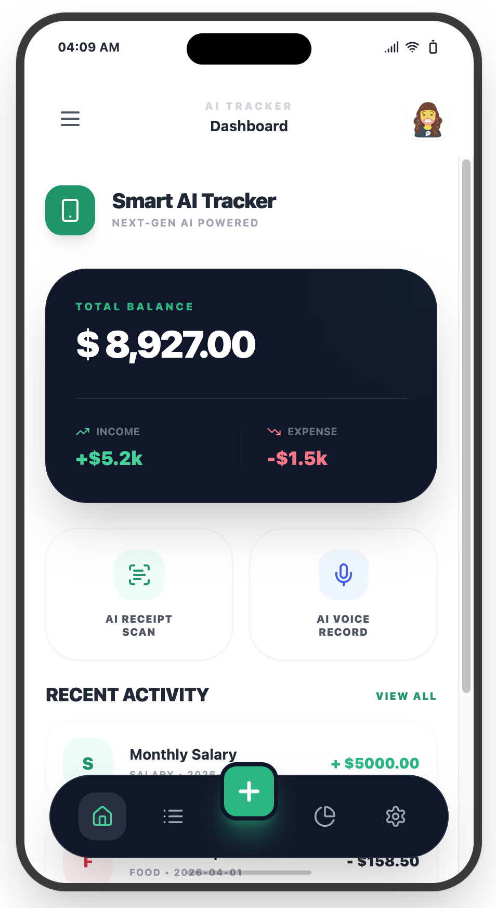

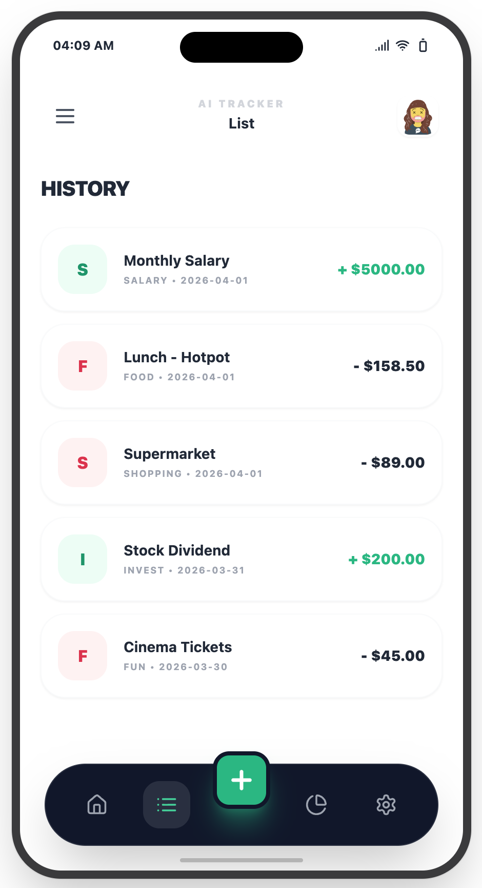

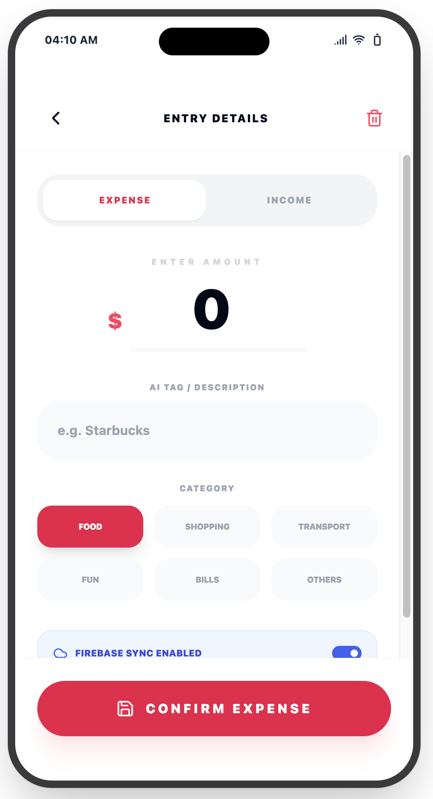

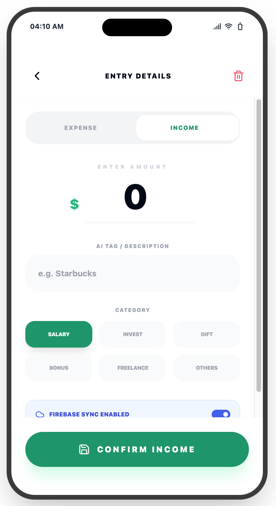

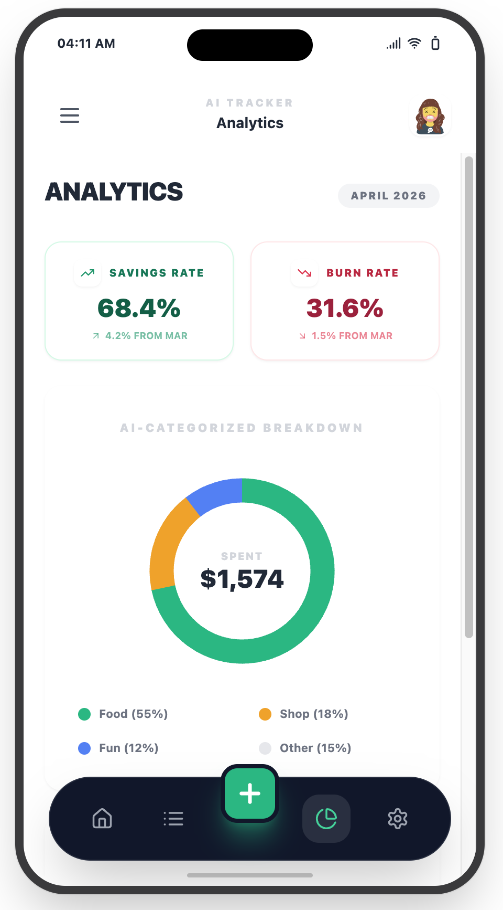

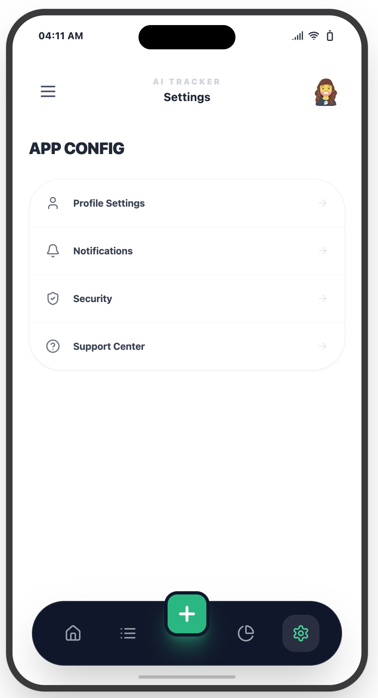

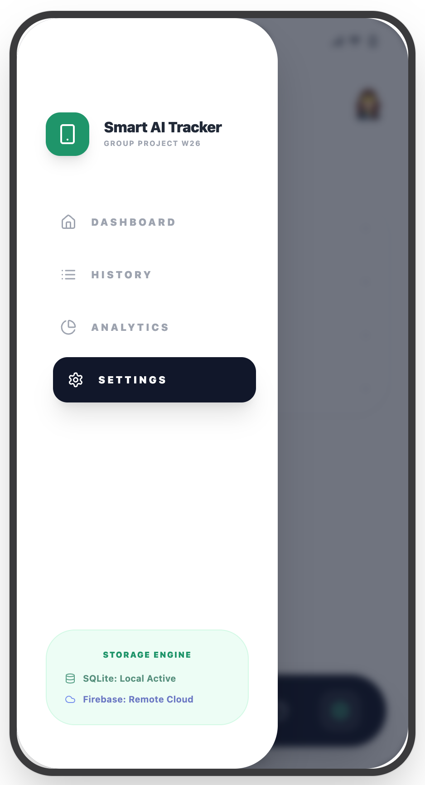

## 3. System Architecture Design

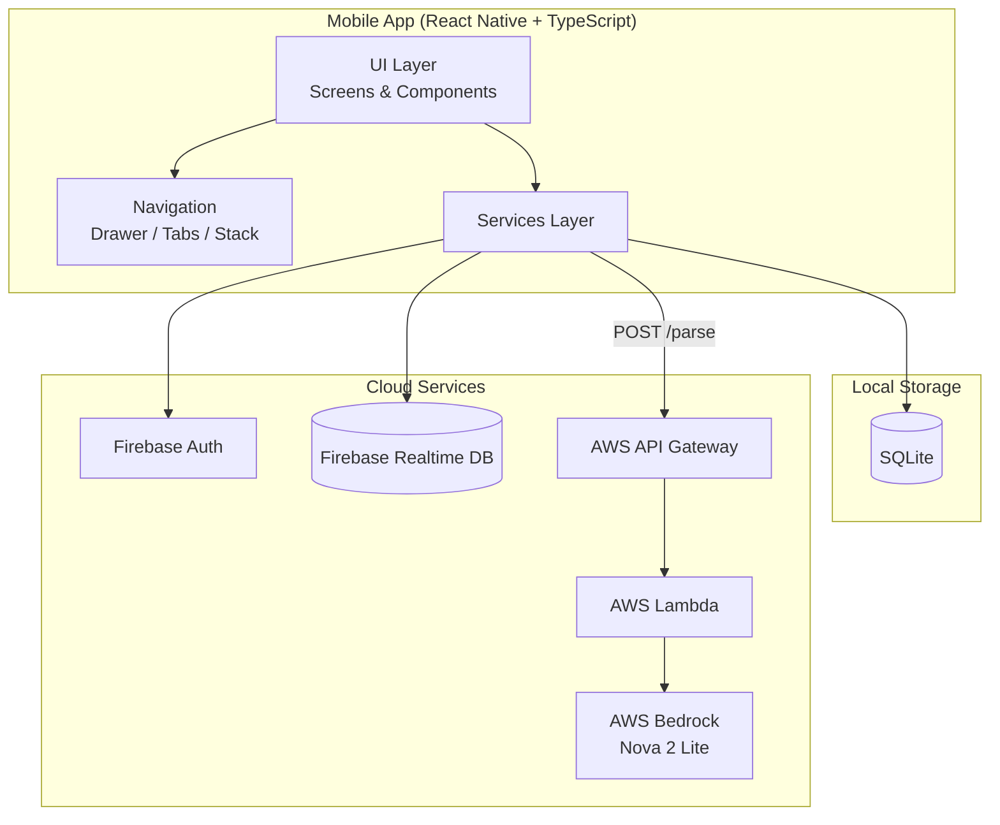
```mermaid
graph TB
    subgraph Mobile["Mobile App (React Native + TypeScript)"]
        UI["UI Layer<br/>Screens & Components"]
        NAV["Navigation<br/>Drawer / Tabs / Stack"]
        SVC["Services Layer"]
    end

    subgraph Local["Local Storage"]
        SQL[(SQLite)]
    end

    subgraph Cloud["Cloud Services"]
        AUTH["Firebase Auth"]
        FBDB[(Firebase Realtime DB)]
        APIGW["AWS API Gateway"]
        LAMBDA["AWS Lambda"]
        BEDROCK["AWS Bedrock<br/>Nova 2 Lite"]
    end

    UI --> NAV
    UI --> SVC
    SVC --> SQL
    SVC --> AUTH
    SVC --> FBDB
    SVC -- "POST /parse" --> APIGW
    APIGW --> LAMBDA
    LAMBDA --> BEDROCK
```

---

## 4. Navigation Flow Design

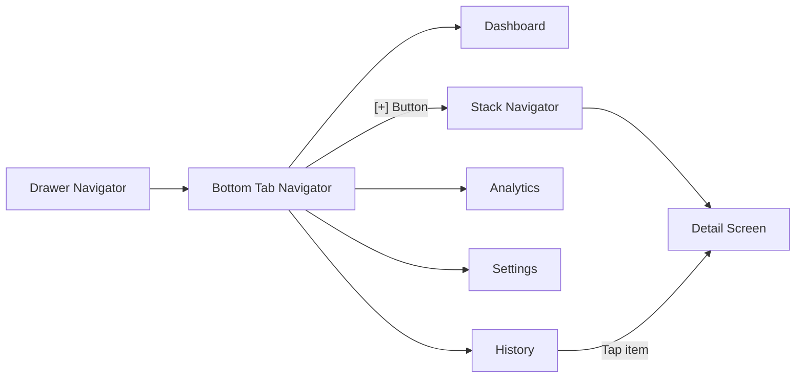
```mermaid
graph LR
    DRAWER["Drawer Navigator"] --> TABS["Bottom Tab Navigator"]
    TABS --> HOME["Dashboard"]
    TABS --> LIST["History"]
    TABS --> STATS["Analytics"]
    TABS --> SETTINGS["Settings"]
    TABS -- "[+] Button" --> STACK["Stack Navigator"]
    STACK --> DETAIL["Detail Screen"]
    LIST -- "Tap item" --> DETAIL
```

| Pattern | Usage |
|---|---|
| Drawer | Side menu accessible via hamburger icon |
| Bottom Tabs | Switch between Home, History, Analytics, Settings |
| Stack | Push Detail screen for adding/editing a transaction |

---

## 5. Database Schema Design

### 5.1 SQLite (Local — Relational)

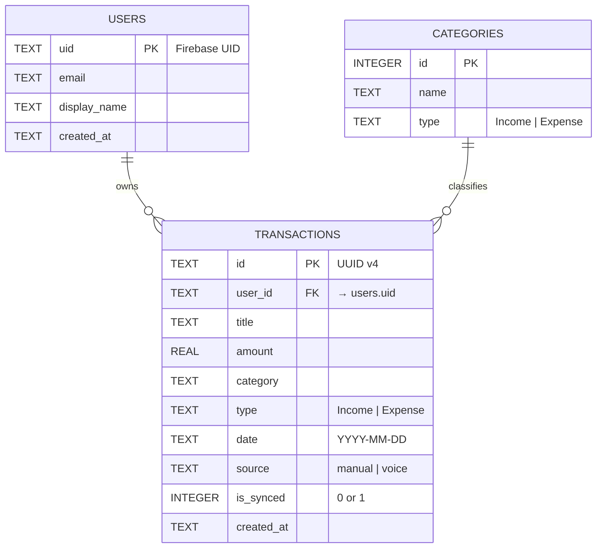
```mermaid
erDiagram
    USERS {
        TEXT uid PK "Firebase UID"
        TEXT email
        TEXT display_name
        TEXT created_at
    }
    TRANSACTIONS {
        TEXT id PK "UUID v4"
        TEXT user_id FK "→ users.uid"
        TEXT title
        REAL amount
        TEXT category
        TEXT type "Income | Expense"
        TEXT date "YYYY-MM-DD"
        TEXT source "manual | voice"
        INTEGER is_synced "0 or 1"
        TEXT created_at
    }
    CATEGORIES {
        INTEGER id PK
        TEXT name
        TEXT type "Income | Expense"
    }

    USERS ||--o{ TRANSACTIONS : "owns"
    CATEGORIES ||--o{ TRANSACTIONS : "classifies"
```

### 5.2 Firebase Realtime Database (Cloud — NoSQL)

```json
{
  "users": {
    "<uid>": {
      "profile": { "email": "...", "displayName": "..." },
      "transactions": {
        "<uuid>": { "title": "...", "amount": 0, "category": "...", "type": "...", "date": "..." }
      }
    }
  }
}
```

Data isolation is enforced by Firebase Security Rules: each user can only access their own `/users/<uid>` node.

### 5.3 Sync Strategy

**Upload (Local → Cloud):** After saving a new transaction locally, push unsynced records to Firebase.

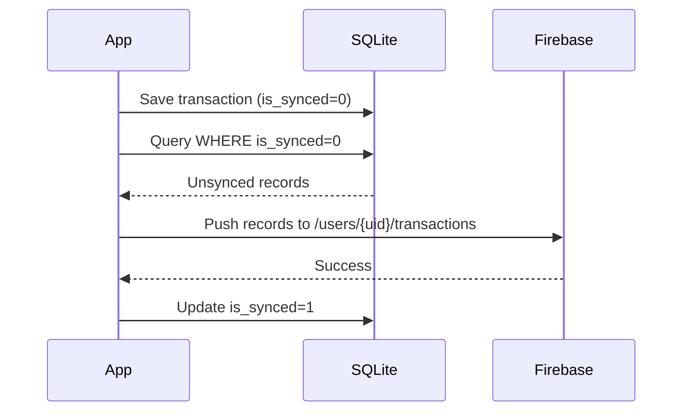
```mermaid
sequenceDiagram
    participant App
    participant SQLite
    participant Firebase

    App->>SQLite: Save transaction (is_synced=0)
    App->>SQLite: Query WHERE is_synced=0
    SQLite-->>App: Unsynced records
    App->>Firebase: Push records to /users/{uid}/transactions
    Firebase-->>App: Success
    App->>SQLite: Update is_synced=1
```

**Download (Cloud → Local):** When a user logs in on a new device, pull all existing records from Firebase into the local SQLite database.

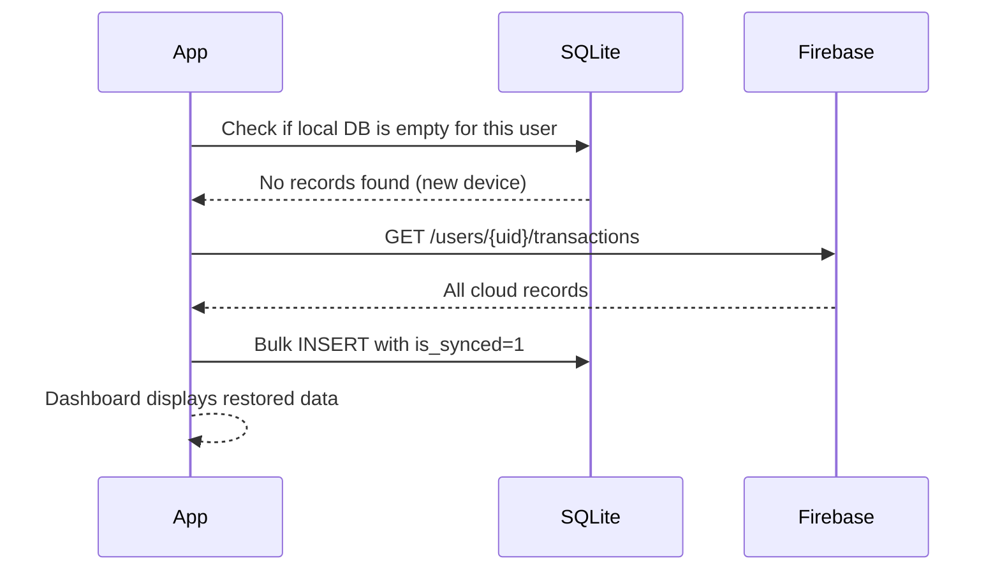
```mermaid
sequenceDiagram
    participant App
    participant SQLite
    participant Firebase

    App->>SQLite: Check if local DB is empty for this user
    SQLite-->>App: No records found (new device)
    App->>Firebase: GET /users/{uid}/transactions
    Firebase-->>App: All cloud records
    App->>SQLite: Bulk INSERT with is_synced=1
    App-->>App: Dashboard displays restored data
```

---

---

# PART 2: Final Stage (Coding & Implementation)

## 6. Real Execution Screenshots (Final App)

As required by the assignment, the following screens demonstrate a fully functional mobile application utilizing various UI components, layouts, and navigation paradigms.

### Screen 1: Dashboard (Home)
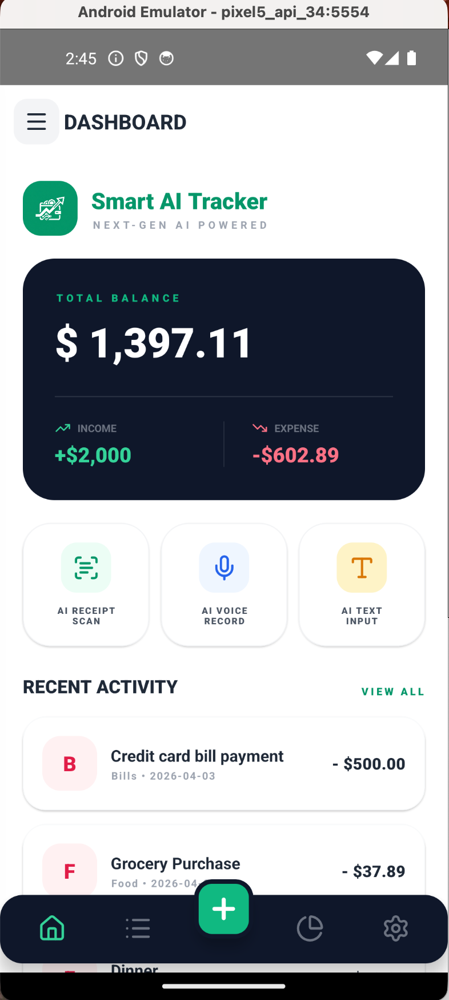

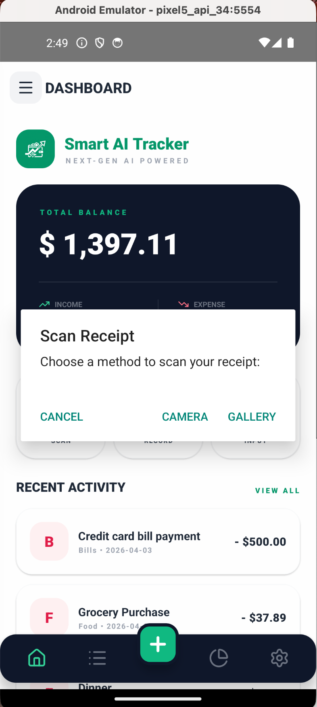

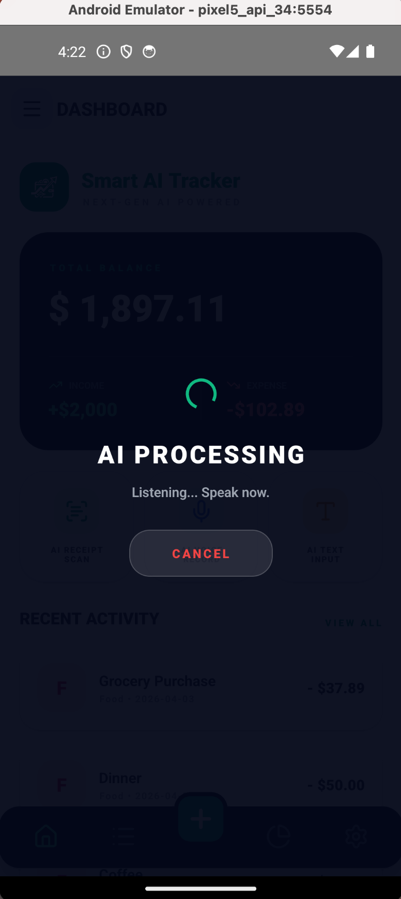

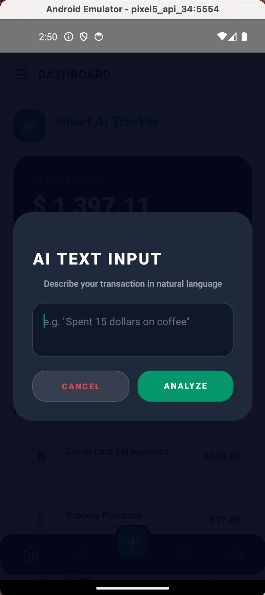

- **Requirement Addressed**: The home screen portrays the brand of the application, prominently featuring the **brand logo** and welcoming interface.
- **Description**: Displays the user's total balance and income/expense breakdown explicitly. Contains interactive elements (AI quick-action buttons) invoking the Device Camera and Microphone to interact with the backend AWS RESTful API.

### Screen 2: History List (Transactions)
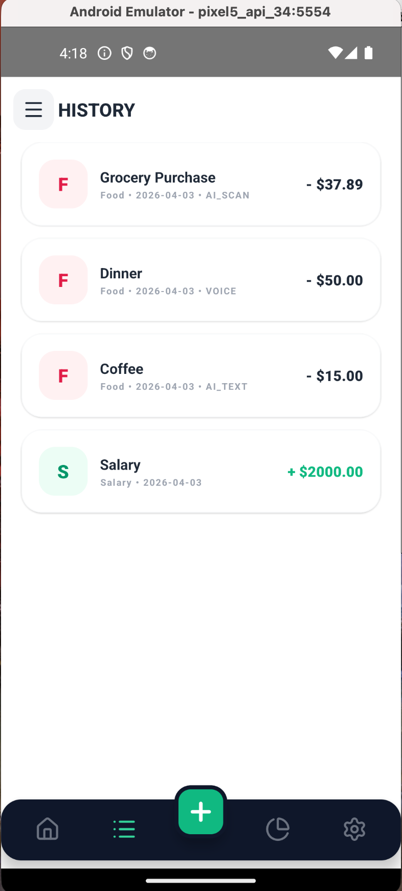

- **Requirement Addressed**: A robust list screen implemented strictly using the React Native `<FlatList>` component to efficiently render dynamic datasets.
- **Description**: Displays all historical financial records isolated from the local SQLite database. Uses complex controls (Touchables) to navigate to details.

### Screen 3: Detail Entry View
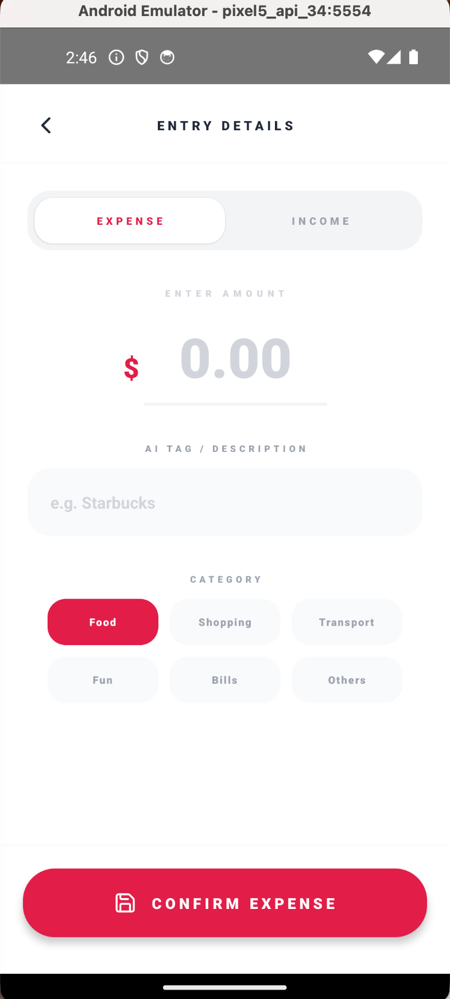

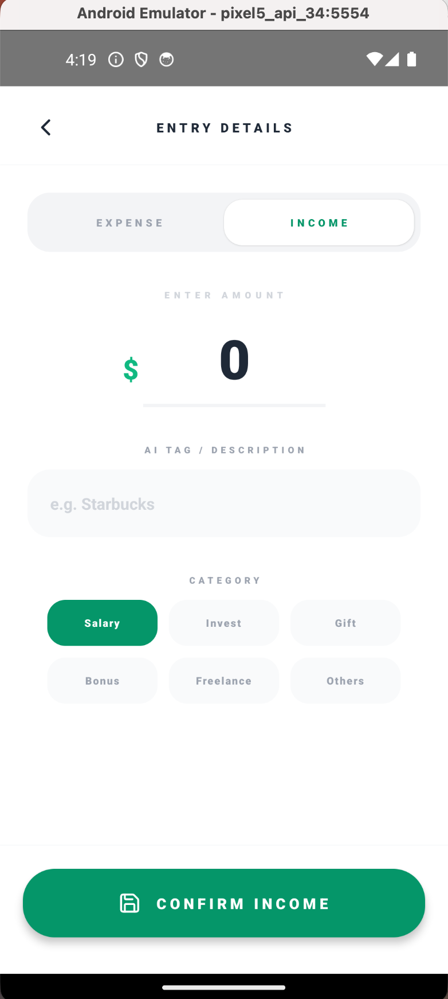

- **Requirement Addressed**: A detail screen dedicated to entering and editing information. 
- **Description**: Utilizes more than 6 distinct types of UI controls including `<TextInput>` (for Title/Amount), `<Switch>` (for Type toggle), `<TouchableOpacity>` (for saves/deletes), Modals, and Action Buttons. Data entered here updates both local SQLite and remote Firebase storage.

### Screen 4: Analytics
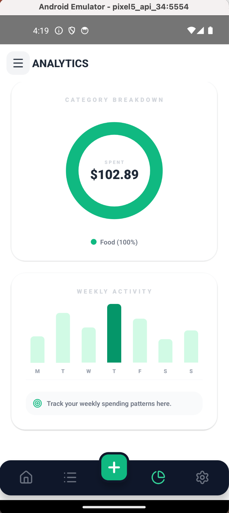

- **Requirement Addressed**: Demonstrates advanced UI capabilities and Event Handlers. 
- **Description**: Provides a visual breakdown of the user's financial health via interactive third-party charts (`react-native-svg`), including Savings Rate, Burn Rate, and dynamically computed category aggregation.

### Screen 5: App Configuration

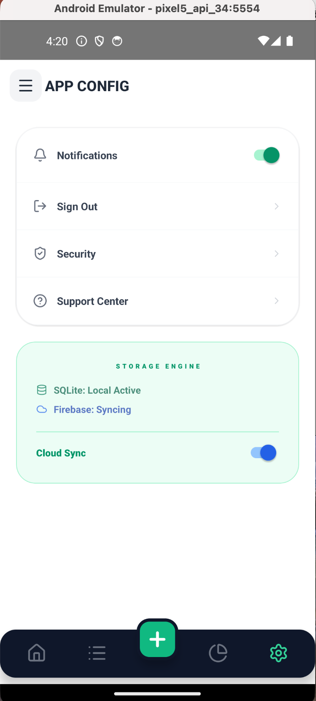

- **Requirement Addressed**: Demonstrates the use of varied screen controls and data management configuration.
- **Description**: Provides an interface for the user to manage application preferences, view session details, and execute actions like secure logout. Includes interactive modals and notification toggles.

### Screen 6: Drawer & Global Navigation

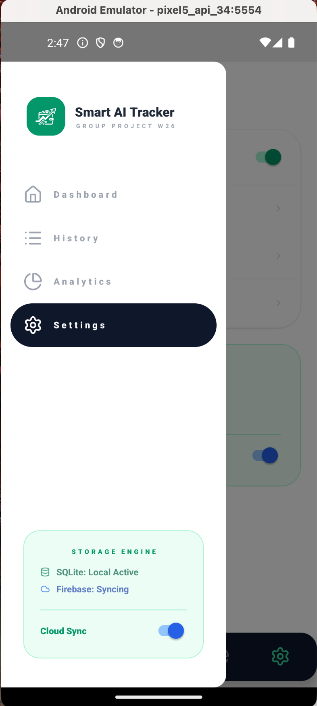

- **Requirement Addressed**: Navigation patterns matching the criteria (Drawer + Tabs + Stack).
- **Description**: The left-side Drawer Navigator complements the Bottom Tabs and the Stack Navigator (used for the Detail View). The settings drawer provides a global Cloud Sync toggle component, seamlessly persisting states across the application's React Context.

### Screen 7: Sign Up & Sign In

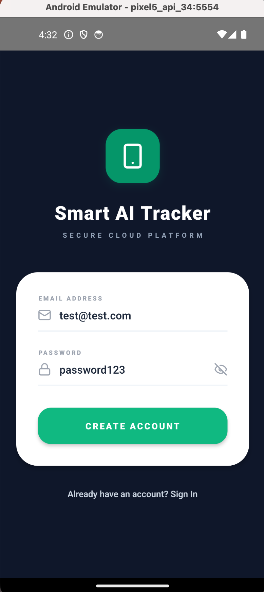

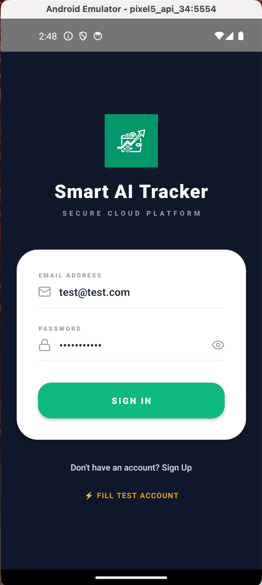

- **Requirement Addressed**: Demonstrates integration with remote Cloud services and backend access control. 
- **Description**: Provides a secure authentication flow natively integrated with Firebase Authentication. Users can log in or register a new account to isolate their transaction history in the cloud database via strict security rules.

---

## 7. AI Backend Implementation

### 7.1 Flow

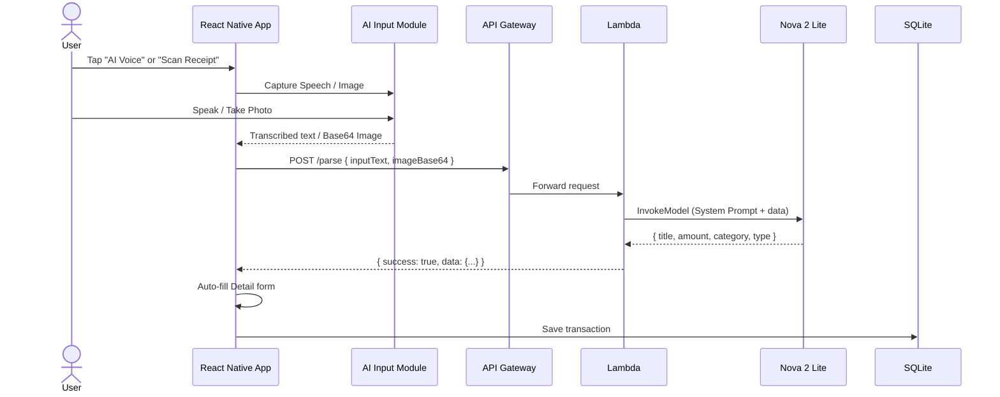
```mermaid
sequenceDiagram
    actor User
    participant App as React Native App
    participant AI as AI Input Module
    participant API as API Gateway
    participant Lambda
    participant Bedrock as Nova 2 Lite

    User->>App: Tap "AI Voice" or "Scan Receipt"
    App->>AI: Capture Speech / Image
    User->>AI: Speak / Take Photo
    AI-->>App: Transcribed text / Base64 Image
    App->>API: POST /parse { inputText, imageBase64 }
    API->>Lambda: Forward request
    Lambda->>Bedrock: InvokeModel (System Prompt + data)
    Bedrock-->>Lambda: { title, amount, category, type }
    Lambda-->>App: { success: true, data: {...} }
    App->>App: Auto-fill Detail form
    App->>SQLite: Save transaction
```

### 7.2 Data Contract

**Request:**
```json
{ 
  "inputText": "Spent 45 dollars on cinema tickets",
  "imageBase64": "<optional_base64_string_for_receipts>" 
}
```

**Response:**
```json
{
  "success": true,
  "data": {
    "title": "Cinema tickets",
    "amount": 45.0,
    "category": "Fun",
    "type": "Expense"
  }
}
```

### 7.3 Lambda Design
- **Runtime:** Node.js 20.x
- **Model:** `us.amazon.nova-2-lite-v1:0` via `@aws-sdk/client-bedrock-runtime`
- **Temperature:** 0.0 (deterministic JSON output)
- **System Prompt:** Constrains the model to return only a JSON object with keys `title`, `amount`, `category`, and `type`. Invalid inputs return a safe fallback response.

---

## 8. Key Technologies Stack

| Layer | Technology |
|---|---|
| Framework | React Native CLI + TypeScript |
| Navigation | React Navigation (Drawer, Tabs, Stack) |
| Local DB | SQLite (`@op-engineering/op-sqlite`) |
| Cloud DB | Firebase Realtime Database |
| Auth | Firebase Authentication |
| AI Backend | AWS API Gateway + Lambda + Bedrock Nova 2 Lite |
| Voice | `@react-native-voice/voice` |
| Icons | `lucide-react-native` |
| Charts | `react-native-svg` |

---
*End of Document*

---

## 9. Appendix: Complete Source Code

### File: `SmartAITracker/App.tsx`

```typescript
/**
 * Smart AI Tracker — Main Application Entry Point
 * Initializes the database and sets up the navigation container.
 */
import React, {useEffect, useState} from 'react';
import {View, Text, ActivityIndicator, StyleSheet} from 'react-native';
import {NavigationContainer} from '@react-navigation/native';
import {GestureHandlerRootView} from 'react-native-gesture-handler';
import RootNavigator from './src/navigation/RootNavigator';
import * as DatabaseService from './src/services/DatabaseService';
import {SyncProvider} from './src/contexts/SyncContext';

const App: React.FC = () => {
  const [isReady, setIsReady] = useState(false);
  const [error, setError] = useState<string | null>(null);

  useEffect(() => {
    initApp();
  }, []);

  const initApp = async () => {
    try {
      // Initialize SQLite database and create tables (synchronous with JSI)
      DatabaseService.initDatabase();
      setIsReady(true);
    } catch (err) {
      console.error('App initialization error:', err);
      setError('Failed to initialize database.');
    }
  };

  // Loading screen while database initializes
  if (!isReady) {
    return (
      <View style={styles.loadingContainer}>
        {error ? (
          <Text style={styles.errorText}>{error}</Text>
        ) : (
          <>
            <ActivityIndicator size="large" color="#10b981" />
            <Text style={styles.loadingText}>Initializing Smart AI Tracker...</Text>
          </>
        )}
      </View>
    );
  }

  return (
    <GestureHandlerRootView style={styles.root}>
      <SyncProvider>
        <NavigationContainer>
          <RootNavigator />
        </NavigationContainer>
      </SyncProvider>
    </GestureHandlerRootView>
  );
};

const styles = StyleSheet.create({
  root: {flex: 1},
  loadingContainer: {
    flex: 1,
    backgroundColor: '#0f172a',
    alignItems: 'center',
    justifyContent: 'center',
    gap: 20,
  },
  loadingText: {
    color: '#9ca3af',
    fontSize: 13,
    fontWeight: '600',
  },
  errorText: {
    color: '#ef4444',
    fontSize: 14,
    fontWeight: '700',
  },
});

export default App;
```

### File: `SmartAITracker/index.js`

```typescript
/**
 * @format
 */
import 'react-native-get-random-values';

import { AppRegistry } from 'react-native';
import App from './App';
import { name as appName } from './app.json';

AppRegistry.registerComponent(appName, () => App);
```

### File: `SmartAITracker/package.json`

```typescript
{
  "name": "SmartAITracker",
  "version": "0.0.1",
  "private": true,
  "scripts": {
    "android": "react-native run-android",
    "ios": "react-native run-ios",
    "lint": "eslint .",
    "start": "react-native start",
    "test": "jest",
    "postinstall": "bash scripts/postinstall.sh"
  },
  "dependencies": {
    "@dbkable/react-native-speech-to-text": "^1.0.0",
    "@op-engineering/op-sqlite": "^15.2.10",
    "@react-native-async-storage/async-storage": "^2.2.0",
    "@react-native-firebase/app": "^24.0.0",
    "@react-native-firebase/auth": "^24.0.0",
    "@react-native-firebase/database": "^24.0.0",
    "@react-native/new-app-screen": "0.84.1",
    "@react-navigation/bottom-tabs": "^7.15.9",
    "@react-navigation/drawer": "^7.9.8",
    "@react-navigation/native": "^7.2.2",
    "@react-navigation/stack": "^7.8.9",
    "lucide-react-native": "^1.7.0",
    "react": "19.2.3",
    "react-native": "0.84.1",
    "react-native-config": "^1.6.1",
    "react-native-gesture-handler": "^2.30.1",
    "react-native-get-random-values": "^2.0.0",
    "react-native-image-picker": "^8.2.1",
    "react-native-reanimated": "^4.3.0",
    "react-native-safe-area-context": "^5.7.0",
    "react-native-screens": "^4.24.0",
    "react-native-svg": "^15.15.4",
    "react-native-worklets": "^0.8.1",
    "uuid": "^13.0.0"
  },
  "devDependencies": {
    "@babel/core": "^7.25.2",
    "@babel/preset-env": "^7.25.3",
    "@babel/runtime": "^7.25.0",
    "@react-native-community/cli": "20.1.0",
    "@react-native-community/cli-platform-android": "20.1.0",
    "@react-native-community/cli-platform-ios": "20.1.0",
    "@react-native/babel-preset": "0.84.1",
    "@react-native/eslint-config": "0.84.1",
    "@react-native/metro-config": "0.84.1",
    "@react-native/typescript-config": "0.84.1",
    "@types/jest": "^29.5.13",
    "@types/react": "^19.2.0",
    "@types/react-test-renderer": "^19.1.0",
    "@types/uuid": "^10.0.0",
    "eslint": "^8.19.0",
    "jest": "^29.6.3",
    "prettier": "2.8.8",
    "react-test-renderer": "19.2.3",
    "typescript": "^5.8.3"
  },
  "engines": {
    "node": ">= 22.11.0"
  }
}
```

### File: `SmartAITracker/src/constants/categories.ts`

```typescript
/**
 * Smart AI Tracker — Category Constants
 */
import {CategoryName} from '../types';

export const EXPENSE_CATEGORIES: CategoryName[] = [
  'Food',
  'Shopping',
  'Transport',
  'Fun',
  'Bills',
  'Others',
];

export const INCOME_CATEGORIES: CategoryName[] = [
  'Salary',
  'Invest',
  'Gift',
  'Bonus',
  'Freelance',
  'Others',
];

// Color mapping for category display
export const CATEGORY_COLORS: Record<string, string> = {
  Food: '#10b981',
  Shopping: '#f59e0b',
  Transport: '#3b82f6',
  Fun: '#8b5cf6',
  Bills: '#ef4444',
  Salary: '#10b981',
  Invest: '#06b6d4',
  Gift: '#ec4899',
  Bonus: '#f59e0b',
  Freelance: '#6366f1',
  Others: '#94a3b8',
};
```

### File: `SmartAITracker/src/contexts/SyncContext.tsx`

```typescript
/**
 * Smart AI Tracker — Sync Context
 * Shared state for Cloud Sync toggle, so Drawer and Settings stay in sync.
 */
import React, {createContext, useState, useContext, useEffect} from 'react';
import AsyncStorage from '@react-native-async-storage/async-storage';

const SYNC_KEY = '@cloud_sync_enabled';

type SyncContextType = {
  syncEnabled: boolean;
  setSyncEnabled: (value: boolean) => void;
};

const SyncContext = createContext<SyncContextType>({
  syncEnabled: true,
  setSyncEnabled: () => {},
});

export const SyncProvider: React.FC<{children: React.ReactNode}> = ({children}) => {
  const [syncEnabled, setSyncEnabledState] = useState(true);

  useEffect(() => {
    AsyncStorage.getItem(SYNC_KEY).then(val => {
      if (val !== null) setSyncEnabledState(val === 'true');
    });
  }, []);

  const setSyncEnabled = async (value: boolean) => {
    setSyncEnabledState(value);
    await AsyncStorage.setItem(SYNC_KEY, value.toString());
  };

  return (
    <SyncContext.Provider value={{syncEnabled, setSyncEnabled}}>
      {children}
    </SyncContext.Provider>
  );
};

export const useSyncEnabled = () => useContext(SyncContext);
```

### File: `SmartAITracker/src/navigation/DrawerNavigator.tsx`

```typescript
/**
 * Smart AI Tracker — Drawer Navigator
 * Side menu navigation wrapping the Tab navigator.
 */
import React from 'react';
import {View, Text, TouchableOpacity, Switch, StyleSheet, Image} from 'react-native';
import {
  createDrawerNavigator,
  DrawerContentScrollView,
  DrawerItem,
  DrawerContentComponentProps,
} from '@react-navigation/drawer';
import {
  Smartphone,
  Database,
  Cloud,
  Home,
  List,
  PieChart,
  Settings,
  Menu,
} from 'lucide-react-native';
import {RootDrawerParamList} from '../types';
import TabNavigator from './TabNavigator';
import HistoryScreen from '../screens/HistoryScreen';
import AnalyticsScreen from '../screens/AnalyticsScreen';
import SettingsScreen from '../screens/SettingsScreen';
import {getFocusedRouteNameFromRoute} from '@react-navigation/native';
import {useSyncEnabled} from '../contexts/SyncContext';

const Drawer = createDrawerNavigator<RootDrawerParamList>();

// Custom drawer content with brand header and storage status
const CustomDrawerContent: React.FC<DrawerContentComponentProps> = props => {
  const currentRoute = props.state.routes[props.state.index];
  const activeRouteName = getFocusedRouteNameFromRoute(currentRoute) ?? 'Dashboard';
  const {syncEnabled, setSyncEnabled} = useSyncEnabled();

  return (
    <DrawerContentScrollView {...props} contentContainerStyle={styles.drawerContent}>
      {/* Brand Header */}
      <View style={styles.brandRow}>
        <Image 
          source={require('../assets/images/logo.png')} 
          style={{width: 48, height: 48, borderRadius: 16}} 
        />
        <View>
          <Text style={styles.brandTitle}>Smart AI Tracker</Text>
          <Text style={styles.brandSub}>GROUP PROJECT W26</Text>
        </View>
      </View>

      {/* Navigation Items mapping to TabNavigator */}
      <View style={{marginTop: 10}}>
        <DrawerItem
          label="Dashboard"
          icon={({color, size}) => <Home color={color} size={size} />}
          labelStyle={styles.drawerLabel}
          focused={activeRouteName === 'Dashboard'}
          activeTintColor="#fff"
          activeBackgroundColor="#0f172a"
          inactiveTintColor="#9ca3af"
          onPress={() => props.navigation.navigate('MainTabs', {screen: 'Dashboard'})}
        />
        <DrawerItem
          label="History"
          icon={({color, size}) => <List color={color} size={size} />}
          labelStyle={styles.drawerLabel}
          focused={activeRouteName === 'History'}
          activeTintColor="#fff"
          activeBackgroundColor="#0f172a"
          inactiveTintColor="#9ca3af"
          onPress={() => props.navigation.navigate('MainTabs', {screen: 'History'})}
        />
        <DrawerItem
          label="Analytics"
          icon={({color, size}) => <PieChart color={color} size={size} />}
          labelStyle={styles.drawerLabel}
          focused={activeRouteName === 'Analytics'}
          activeTintColor="#fff"
          activeBackgroundColor="#0f172a"
          inactiveTintColor="#9ca3af"
          onPress={() => props.navigation.navigate('MainTabs', {screen: 'Analytics'})}
        />
        <DrawerItem
          label="Settings"
          icon={({color, size}) => <Settings color={color} size={size} />}
          labelStyle={styles.drawerLabel}
          focused={activeRouteName === 'Settings'}
          activeTintColor="#fff"
          activeBackgroundColor="#0f172a"
          inactiveTintColor="#9ca3af"
          onPress={() => props.navigation.navigate('MainTabs', {screen: 'Settings'})}
        />
      </View>

      {/* Storage Engine Card */}
      <View style={styles.storageCard}>
        <Text style={styles.storageTitle}>STORAGE ENGINE</Text>
        <View style={styles.storageRow}>
          <Database color="#047857" size={12} />
          <Text style={styles.storageLabel}>SQLite: Local Active</Text>
        </View>
        <View style={styles.storageRow}>
          <Cloud color="#2563eb" size={12} />
          <Text style={[styles.storageLabel, {color: '#1e40af'}]}>
            Firebase: {syncEnabled ? 'Syncing' : 'Paused'}
          </Text>
        </View>
        <View style={styles.syncRow}>
          <Text style={styles.syncLabel}>Cloud Sync</Text>
          <Switch
            value={syncEnabled}
            onValueChange={setSyncEnabled}
            trackColor={{false: '#e5e7eb', true: '#93c5fd'}}
            thumbColor={syncEnabled ? '#2563eb' : '#9ca3af'}
          />
        </View>
      </View>
    </DrawerContentScrollView>
  );
};

const TAB_TITLES: Record<string, string> = {
  Dashboard: 'DASHBOARD',
  History: 'HISTORY',
  Analytics: 'ANALYTICS',
  Settings: 'APP CONFIG',
};

const DrawerNavigator: React.FC = () => {
  return (
    <Drawer.Navigator
      drawerContent={props => <CustomDrawerContent {...props} />}
      screenOptions={({navigation, route}) => ({
        headerShown: true,
        headerTitle: TAB_TITLES[getFocusedRouteNameFromRoute(route) ?? 'Dashboard'] || 'DASHBOARD',
        headerTitleStyle: {fontSize: 18, fontWeight: '900', color: '#1f2937'},
        headerStyle: {backgroundColor: '#fff', elevation: 0, shadowOpacity: 0},
        headerLeft: () => (
          <TouchableOpacity
            style={drawerStyles.menuBtn}
            onPress={() => navigation.toggleDrawer()}>
            <Menu color="#1f2937" size={22} />
          </TouchableOpacity>
        ),
        drawerStyle: styles.drawer,
        drawerActiveBackgroundColor: '#0f172a',
        drawerActiveTintColor: '#fff',
        drawerInactiveTintColor: '#9ca3af',
        drawerLabelStyle: styles.drawerLabel,
      })}>
      <Drawer.Screen
        name="MainTabs"
        component={TabNavigator}
        options={{
          drawerItemStyle: {display: 'none'},
        }}
      />
    </Drawer.Navigator>
  );
};

const drawerStyles = StyleSheet.create({
  menuBtn: {width: 40, height: 40, alignItems: 'center', justifyContent: 'center', borderRadius: 12, backgroundColor: '#f3f4f6', marginLeft: 12},
});

const styles = StyleSheet.create({
  drawer: {width: 280, backgroundColor: '#fff'},
  drawerContent: {flex: 1, paddingTop: 20},
  drawerLabel: {
    fontSize: 11, fontWeight: '900', letterSpacing: 3,
  },
  brandRow: {
    flexDirection: 'row', alignItems: 'center', gap: 12,
    paddingHorizontal: 20, paddingVertical: 24, marginBottom: 12,
  },
  brandIcon: {
    width: 48, height: 48, backgroundColor: '#059669', borderRadius: 16,
    alignItems: 'center', justifyContent: 'center',
  },
  brandTitle: {fontSize: 16, fontWeight: '900', color: '#1f2937'},
  brandSub: {fontSize: 7, fontWeight: '700', color: '#9ca3af', letterSpacing: 3, marginTop: 2},
  storageCard: {
    backgroundColor: '#ecfdf5', borderRadius: 20, padding: 20,
    marginHorizontal: 16, marginTop: 'auto', marginBottom: 24,
    borderWidth: 1, borderColor: '#a7f3d0',
  },
  storageTitle: {
    fontSize: 8, fontWeight: '900', color: '#059669',
    letterSpacing: 3, textAlign: 'center', marginBottom: 12,
  },
  storageRow: {
    flexDirection: 'row', alignItems: 'center', gap: 8,
    marginBottom: 6, opacity: 0.7,
  },
  storageLabel: {fontSize: 11, fontWeight: '700', color: '#065f46'},
  syncRow: {
    flexDirection: 'row', justifyContent: 'space-between',
    alignItems: 'center', marginTop: 12, paddingTop: 12,
    borderTopWidth: 1, borderTopColor: '#a7f3d0',
  },
  syncLabel: {fontSize: 11, fontWeight: '900', color: '#059669'},
});

export default DrawerNavigator;
```

### File: `SmartAITracker/src/navigation/RootNavigator.tsx`

```typescript
/**
 * Smart AI Tracker — Root Navigator
 * Stack navigator wrapping Drawer, with Detail screen pushed on top.
 */
import React, {useState, useEffect} from 'react';
import {createStackNavigator} from '@react-navigation/stack';
import {View, ActivityIndicator} from 'react-native';
import {FirebaseAuthTypes} from '@react-native-firebase/auth';
import {RootStackParamList} from '../types';
import * as FirebaseService from '../services/FirebaseService';
import * as DatabaseService from '../services/DatabaseService';
import DrawerNavigator from './DrawerNavigator';
import DetailScreen from '../screens/DetailScreen';
import AuthScreen from '../screens/AuthScreen';

const Stack = createStackNavigator<RootStackParamList>();

const RootNavigator: React.FC = () => {
  const [initializing, setInitializing] = useState(true);
  const [user, setUser] = useState<FirebaseAuthTypes.User | null>(null);

  useEffect(() => {
    const subscriber = FirebaseService.onAuthStateChanged(async authUser => {
      setUser(authUser);

      // When user logs in, sync cloud data to local DB if local is empty
      if (authUser) {
        try {
          const localRecords = DatabaseService.getTransactions(authUser.uid);
          if (localRecords.length === 0) {
            console.log('Local DB empty, syncing from cloud...');
            const cloudRecords = await FirebaseService.fetchTransactionsFromCloud(authUser.uid);
            if (cloudRecords.length > 0) {
              DatabaseService.bulkInsertTransactions(cloudRecords);
              console.log(`Synced ${cloudRecords.length} records from cloud.`);
            }
          }
          // Ensure user exists in local DB
          DatabaseService.ensureUserExists(
            authUser.uid,
            authUser.email || '',
            authUser.displayName || '',
          );
        } catch (err) {
          console.error('Cloud sync error:', err);
        }
      }

      if (initializing) {
        setInitializing(false);
      }
    });
    return subscriber;
  }, [initializing]);

  if (initializing) {
    return (
      <View style={{flex: 1, justifyContent: 'center', alignItems: 'center', backgroundColor: '#0f172a'}}>
        <ActivityIndicator size="large" color="#10b981" />
      </View>
    );
  }

  return (
    <Stack.Navigator screenOptions={{headerShown: false}}>
      {!user ? (
        <Stack.Screen name="Auth" component={AuthScreen} />
      ) : (
        <>
          <Stack.Screen name="DrawerRoot" component={DrawerNavigator} />
          <Stack.Screen
            name="Detail"
            component={DetailScreen}
            options={{
              presentation: 'modal',
              gestureEnabled: true,
            }}
          />
        </>
      )}
    </Stack.Navigator>
  );
};

export default RootNavigator;
```

### File: `SmartAITracker/src/navigation/TabNavigator.tsx`

```typescript
/**
 * Smart AI Tracker — Bottom Tab Navigator
 * Contains Dashboard, History, [+] Add, Analytics, Settings.
 */
import React from 'react';
import {View, TouchableOpacity, StyleSheet} from 'react-native';
import {createBottomTabNavigator} from '@react-navigation/bottom-tabs';
import {useNavigation} from '@react-navigation/native';
import {Home, List, Plus, PieChart, Settings} from 'lucide-react-native';
import {MainTabParamList} from '../types';

import DashboardScreen from '../screens/DashboardScreen';
import HistoryScreen from '../screens/HistoryScreen';
import AnalyticsScreen from '../screens/AnalyticsScreen';
import SettingsScreen from '../screens/SettingsScreen';

const Tab = createBottomTabNavigator<MainTabParamList>();

// Placeholder screen for the center "Add" tab (never actually shown)
const AddPlaceholder: React.FC = () => <View />;

const TabNavigator: React.FC = () => {
  const navigation = useNavigation<any>();

  return (
    <Tab.Navigator
      screenOptions={{
        headerShown: false,
        tabBarStyle: styles.tabBar,
        tabBarShowLabel: false,
        tabBarActiveTintColor: '#34d399',
        tabBarInactiveTintColor: '#6b7280',
        tabBarItemStyle: {
          top: 10,
        },
      }}>
      <Tab.Screen
        name="Dashboard"
        component={DashboardScreen}
        options={{
          tabBarIcon: ({color, size}) => <Home color={color} size={size} />,
        }}
      />
      <Tab.Screen
        name="History"
        component={HistoryScreen}
        options={{
          tabBarIcon: ({color, size}) => <List color={color} size={size} />,
        }}
      />
      <Tab.Screen
        name="AddPlaceholder"
        component={AddPlaceholder}
        options={{
          tabBarButton: () => (
            <View style={{flex: 1, alignItems: 'center'}}>
              <TouchableOpacity
                style={styles.addBtn}
                onPress={() =>
                  navigation.navigate('Detail', {
                    transaction: {title: '', amount: 0, type: 'Expense'},
                  })
                }>
                <Plus color="#fff" size={28} strokeWidth={3} />
              </TouchableOpacity>
            </View>
          ),
        }}
      />
      <Tab.Screen
        name="Analytics"
        component={AnalyticsScreen}
        options={{
          tabBarIcon: ({color, size}) => <PieChart color={color} size={size} />,
        }}
      />
      <Tab.Screen
        name="Settings"
        component={SettingsScreen}
        options={{
          tabBarIcon: ({color, size}) => <Settings color={color} size={size} />,
        }}
      />
    </Tab.Navigator>
  );
};

const styles = StyleSheet.create({
  tabBar: {
    backgroundColor: '#0f172a',
    borderTopWidth: 0,
    height: 60,
    borderRadius: 20,
    position: 'absolute',
    bottom: 8,
    left: 16,
    right: 16,
    elevation: 8,
    paddingHorizontal: 8,
    paddingBottom: 0,
    paddingTop: 0,
    alignItems: 'center',
  },
  addBtn: {
    width: 52,
    height: 52,
    backgroundColor: '#10b981',
    borderRadius: 16,
    alignItems: 'center',
    justifyContent: 'center',
    top: -24,
    elevation: 6,
    borderWidth: 4,
    borderColor: '#0f172a',
  },
});

export default TabNavigator;
```

### File: `SmartAITracker/src/screens/AnalyticsScreen.tsx`

```typescript
/**
 * Smart AI Tracker — Analytics Screen
 * Displays financial analytics with SVG donut chart and bar chart.
 */
import React, {useCallback, useState} from 'react';
import {View, Text, ScrollView, StyleSheet} from 'react-native';
import {useFocusEffect} from '@react-navigation/native';
import Svg, {Circle} from 'react-native-svg';
import {TrendingUp, TrendingDown, Target} from 'lucide-react-native';
import {Transaction} from '../types';
import * as DatabaseService from '../services/DatabaseService';
import * as FirebaseService from '../services/FirebaseService';
import {CATEGORY_COLORS} from '../constants/categories';

const AnalyticsScreen: React.FC = () => {
  const [records, setRecords] = useState<Transaction[]>([]);
  const [totalIncome, setTotalIncome] = useState(0);
  const [totalExpense, setTotalExpense] = useState(0);

  const currentUser = FirebaseService.getCurrentUser();
  const userId = currentUser?.uid || 'unknown';

  useFocusEffect(
    useCallback(() => {
      loadData();
    }, []),
  );

  const loadData = async () => {
    try {
      const transactions = await DatabaseService.getTransactions(userId);
      setRecords(transactions);
      const summary = await DatabaseService.getBalanceSummary(userId);
      setTotalIncome(summary.totalIncome);
      setTotalExpense(summary.totalExpense);
    } catch (error) {
      console.error('Failed to load analytics:', error);
    }
  };

  // Calculate category breakdown for expenses
  const expenseRecords = records.filter(r => r.type === 'Expense');
  const categoryTotals: Record<string, number> = {};
  expenseRecords.forEach(r => {
    categoryTotals[r.category] = (categoryTotals[r.category] || 0) + r.amount;
  });
  const sortedCategories = Object.entries(categoryTotals)
    .sort((a, b) => b[1] - a[1])
    .slice(0, 4);

  const savingsRate =
    totalIncome > 0
      ? (((totalIncome - totalExpense) / totalIncome) * 100).toFixed(1)
      : '0.0';
  const burnRate = totalIncome > 0 ? ((totalExpense / totalIncome) * 100).toFixed(1) : '0.0';

  // SVG donut chart calculations
  const circumference = 2 * Math.PI * 40; // r=40
  let offset = 0;
  const donutSegments = sortedCategories.map(([cat, amount]) => {
    const pct = totalExpense > 0 ? amount / totalExpense : 0;
    const dashArray = pct * circumference;
    const segment = {
      category: cat,
      dashArray,
      offset: -offset,
      color: CATEGORY_COLORS[cat] || '#94a3b8',
      pct: (pct * 100).toFixed(0),
    };
    offset += dashArray;
    return segment;
  });

  return (
    <ScrollView style={styles.container} contentContainerStyle={styles.content}>
      <View style={styles.headerRow}>

        <View style={styles.badge}>
          <Text style={styles.badgeText}>
            {new Date().toLocaleString('en-US', {month: 'long', year: 'numeric'}).toUpperCase()}
          </Text>
        </View>
      </View>

      {/* Summary Cards */}
      <View style={styles.cardRow}>
        <View style={[styles.card, {backgroundColor: '#ecfdf5'}]}>
          <View style={styles.cardIconRow}>
            <TrendingUp color="#059669" size={14} />
            <Text style={[styles.cardLabel, {color: '#047857'}]}>SAVINGS RATE</Text>
          </View>
          <Text style={[styles.cardValue, {color: '#065f46'}]}>{savingsRate}%</Text>
        </View>
        <View style={[styles.card, {backgroundColor: '#fff1f2'}]}>
          <View style={styles.cardIconRow}>
            <TrendingDown color="#e11d48" size={14} />
            <Text style={[styles.cardLabel, {color: '#be123c'}]}>BURN RATE</Text>
          </View>
          <Text style={[styles.cardValue, {color: '#9f1239'}]}>{burnRate}%</Text>
        </View>
      </View>

      {/* Donut Chart */}
      <View style={styles.chartCard}>
        <Text style={styles.chartTitle}>CATEGORY BREAKDOWN</Text>
        <View style={styles.donutContainer}>
          <Svg width={180} height={180} viewBox="0 0 100 100">
            <Circle
              cx="50" cy="50" r="40" fill="transparent"
              stroke="#f3f4f6" strokeWidth={12}
            />
            {donutSegments.map((seg, i) => (
              <Circle
                key={i} cx="50" cy="50" r="40" fill="transparent"
                stroke={seg.color} strokeWidth={12}
                strokeDasharray={`${seg.dashArray} ${circumference}`}
                strokeDashoffset={seg.offset}
                rotation={-90} origin="50, 50"
              />
            ))}
          </Svg>
          <View style={styles.donutCenter}>
            <Text style={styles.donutLabel}>SPENT</Text>
            <Text style={styles.donutValue}>${totalExpense.toLocaleString()}</Text>
          </View>
        </View>
        <View style={styles.legendGrid}>
          {sortedCategories.map(([cat, amount]) => (
            <View key={cat} style={styles.legendItem}>
              <View
                style={[
                  styles.legendDot,
                  {backgroundColor: CATEGORY_COLORS[cat] || '#94a3b8'},
                ]}
              />
              <Text style={styles.legendText}>
                {cat} ({totalExpense > 0 ? ((amount / totalExpense) * 100).toFixed(0) : 0}%)
              </Text>
            </View>
          ))}
        </View>
      </View>

      {/* Weekly Activity (static placeholder) */}
      <View style={styles.chartCard}>
        <Text style={styles.chartTitle}>WEEKLY ACTIVITY</Text>
        <View style={styles.barChart}>
          {['M', 'T', 'W', 'T', 'F', 'S', 'S'].map((day, i) => {
            const heights = [45, 85, 60, 100, 75, 40, 55];
            const h = heights[i];
            return (
              <View key={`${day}-${i}`} style={styles.barCol}>
                <View
                  style={[
                    styles.bar,
                    {
                      height: h,
                      backgroundColor: h === 100 ? '#059669' : '#d1fae5',
                    },
                  ]}
                />
                <Text style={styles.barLabel}>{day}</Text>
              </View>
            );
          })}
        </View>
        <View style={styles.insightRow}>
          <Target color="#10b981" size={16} />
          <Text style={styles.insightText}>
            Track your weekly spending patterns here.
          </Text>
        </View>
      </View>
    </ScrollView>
  );
};

const styles = StyleSheet.create({
  container: {flex: 1, backgroundColor: '#fff'},
  content: {padding: 20, paddingBottom: 100},
  headerRow: {
    flexDirection: 'row', justifyContent: 'space-between',
    alignItems: 'flex-end', marginBottom: 20,
  },
  header: {fontSize: 22, fontWeight: '900', color: '#1f2937'},
  badge: {
    backgroundColor: '#f3f4f6', paddingHorizontal: 12,
    paddingVertical: 4, borderRadius: 20,
  },
  badgeText: {fontSize: 8, fontWeight: '900', color: '#6b7280', letterSpacing: 2},
  cardRow: {flexDirection: 'row', gap: 16, marginBottom: 20},
  card: {
    flex: 1, padding: 16, borderRadius: 20,
    alignItems: 'center', gap: 8,
  },
  cardIconRow: {flexDirection: 'row', alignItems: 'center', gap: 6},
  cardLabel: {fontSize: 8, fontWeight: '900', letterSpacing: 2},
  cardValue: {fontSize: 24, fontWeight: '900'},
  chartCard: {
    backgroundColor: '#fff', borderRadius: 24, padding: 24,
    marginBottom: 20, elevation: 1, borderWidth: 1, borderColor: '#f9fafb',
    alignItems: 'center',
  },
  chartTitle: {
    fontSize: 10, fontWeight: '900', color: '#d1d5db',
    letterSpacing: 3, marginBottom: 24,
  },
  donutContainer: {position: 'relative', alignItems: 'center', justifyContent: 'center', marginBottom: 24},
  donutCenter: {position: 'absolute', alignItems: 'center'},
  donutLabel: {fontSize: 8, fontWeight: '900', color: '#d1d5db', letterSpacing: 2},
  donutValue: {fontSize: 22, fontWeight: '900', color: '#1f2937'},
  legendGrid: {
    flexDirection: 'row', flexWrap: 'wrap', gap: 12,
    justifyContent: 'center',
  },
  legendItem: {flexDirection: 'row', alignItems: 'center', gap: 6},
  legendDot: {width: 10, height: 10, borderRadius: 5},
  legendText: {fontSize: 11, fontWeight: '600', color: '#6b7280'},
  barChart: {
    flexDirection: 'row', alignItems: 'flex-end',
    justifyContent: 'space-between', height: 120,
    width: '100%', paddingHorizontal: 8,
    borderBottomWidth: 1, borderBottomColor: '#f9fafb',
    paddingBottom: 8, marginBottom: 20,
  },
  barCol: {alignItems: 'center', gap: 8},
  bar: {width: 24, borderTopLeftRadius: 6, borderTopRightRadius: 6},
  barLabel: {fontSize: 9, fontWeight: '900', color: '#9ca3af'},
  insightRow: {
    flexDirection: 'row', alignItems: 'center', gap: 8,
    backgroundColor: '#f9fafb', padding: 12, borderRadius: 16,
    width: '100%',
  },
  insightText: {fontSize: 11, fontWeight: '600', color: '#6b7280', flex: 1},
});

export default AnalyticsScreen;
```

### File: `SmartAITracker/src/screens/AuthScreen.tsx`

```typescript
/**
 * Smart AI Tracker — Authentication Screen
 * Secure user login and registration powered by Firebase Auth.
 */
import React, {useState} from 'react';
import {
  View,
  Text,
  TextInput,
  TouchableOpacity,
  StyleSheet,
  Alert,
  KeyboardAvoidingView,
  Platform,
  ActivityIndicator,
} from 'react-native';
import {Smartphone, Mail, Lock, Eye, EyeOff} from 'lucide-react-native';
import * as FirebaseService from '../services/FirebaseService';
import * as DatabaseService from '../services/DatabaseService';

const AuthScreen: React.FC = () => {
  const [isLogin, setIsLogin] = useState(true);
  const [email, setEmail] = useState('test@test.com');
  const [password, setPassword] = useState('password123');
  const [showPassword, setShowPassword] = useState(false);
  const [loading, setLoading] = useState(false);

  const handleAuthenticate = async () => {
    if (!email.trim() || !password.trim()) {
      Alert.alert('Validation Error', 'Please enter both email and password.');
      return;
    }

    setLoading(true);
    try {
      if (isLogin) {
        // Sign In
        const user = await FirebaseService.loginUser(email.trim(), password);
        
        // When logged in, fetch cloud data and populate local database immediately.
        // Doing this before rendering prevents racing conditions in the Dashboard.
        const cloudData = await FirebaseService.fetchTransactionsFromCloud(user.uid);
        if (cloudData.length > 0) {
          DatabaseService.bulkInsertTransactions(cloudData);
        }
      } else {
        // Sign Up
        const user = await FirebaseService.registerUser(email.trim(), password);
        // Save initial profile
        await FirebaseService.saveUserProfile(user.uid, user.email || '', 'New User');
        // Ensure user is created in local SQLite immediately
        DatabaseService.ensureUserExists(user.uid, user.email || '', 'New User');
      }
      // Note: We do not manually navigate away because RootNavigator's onAuthStateChanged 
      // will proactively swap the screen from Auth to DrawerRoot automatically!
    } catch (error: any) {
      console.error('Authentication Error:', error);
      Alert.alert(
        'Authentication Failed',
        error.message || 'Check your credentials and try again.',
      );
    } finally {
      setLoading(false);
    }
  };

  return (
    <KeyboardAvoidingView
      behavior={Platform.OS === 'ios' ? 'padding' : 'height'}
      style={styles.container}>
      <View style={styles.content}>
        {/* Logo / Branding */}
        <View style={styles.brandContainer}>
          <View style={styles.iconWrapper}>
            <Smartphone color="#fff" size={40} />
          </View>
          <Text style={styles.brandTitle}>Smart AI Tracker</Text>
          <Text style={styles.brandSub}>SECURE CLOUD PLATFORM</Text>
        </View>

        {/* Input Form */}
        <View style={styles.formCard}>
          <View style={styles.inputGroup}>
            <Text style={styles.label}>EMAIL ADDRESS</Text>
            <View style={styles.inputRow}>
              <Mail color="#9ca3af" size={20} />
              <TextInput
                style={styles.input}
                placeholder="you@example.com"
                placeholderTextColor="#d1d5db"
                keyboardType="email-address"
                autoCapitalize="none"
                value={email}
                onChangeText={setEmail}
              />
            </View>
          </View>

          <View style={styles.inputGroup}>
            <Text style={styles.label}>PASSWORD</Text>
            <View style={styles.inputRow}>
              <Lock color="#9ca3af" size={20} />
              <TextInput
                style={styles.input}
                placeholder="••••••••"
                placeholderTextColor="#d1d5db"
                secureTextEntry={!showPassword}
                value={password}
                onChangeText={setPassword}
              />
              <TouchableOpacity onPress={() => setShowPassword(!showPassword)}>
                {showPassword ? (
                  <EyeOff color="#9ca3af" size={20} />
                ) : (
                  <Eye color="#9ca3af" size={20} />
                )}
              </TouchableOpacity>
            </View>
          </View>

          <TouchableOpacity
            style={styles.primaryBtn}
            onPress={handleAuthenticate}
            disabled={loading}>
            {loading ? (
              <ActivityIndicator color="#fff" />
            ) : (
              <Text style={styles.primaryBtnText}>
                {isLogin ? 'SIGN IN' : 'CREATE ACCOUNT'}
              </Text>
            )}
          </TouchableOpacity>
        </View>

        {/* Toggle Mode */}
        <TouchableOpacity
          style={styles.toggleBtn}
          onPress={() => setIsLogin(!isLogin)}
          disabled={loading}>
          <Text style={styles.toggleText}>
            {isLogin
              ? "Don't have an account? Sign Up"
              : 'Already have an account? Sign In'}
          </Text>
        </TouchableOpacity>

        {/* Quick Test Login */}
        {isLogin && (
          <TouchableOpacity
            style={styles.quickLoginBtn}
            onPress={() => {
              setEmail('test@test.com');
              setPassword('password123');
            }}
            disabled={loading}>
            <Text style={styles.quickLoginText}>⚡ FILL TEST ACCOUNT</Text>
          </TouchableOpacity>
        )}
      </View>
    </KeyboardAvoidingView>
  );
};

const styles = StyleSheet.create({
  container: {flex: 1, backgroundColor: '#0f172a'}, // Deep navy brand color
  content: {flex: 1, justifyContent: 'center', padding: 24},
  brandContainer: {alignItems: 'center', marginBottom: 48},
  iconWrapper: {
    width: 80,
    height: 80,
    backgroundColor: '#059669',
    borderRadius: 24,
    alignItems: 'center',
    justifyContent: 'center',
    marginBottom: 24,
    elevation: 8,
    shadowColor: '#059669',
    shadowOpacity: 0.4,
    shadowRadius: 12,
  },
  brandTitle: {fontSize: 28, fontWeight: '900', color: '#fff', letterSpacing: 1},
  brandSub: {fontSize: 10, fontWeight: '700', color: '#94a3b8', letterSpacing: 4, marginTop: 8},
  formCard: {
    backgroundColor: '#fff',
    borderRadius: 32,
    padding: 32,
    gap: 24,
    elevation: 4,
  },
  inputGroup: {gap: 8},
  label: {fontSize: 9, fontWeight: '900', color: '#9ca3af', letterSpacing: 2},
  inputRow: {
    flexDirection: 'row',
    alignItems: 'center',
    gap: 12,
    borderBottomWidth: 2,
    borderBottomColor: '#f1f5f9',
    paddingBottom: 12,
  },
  input: {flex: 1, fontSize: 16, fontWeight: '600', color: '#1e293b', padding: 0},
  primaryBtn: {
    backgroundColor: '#10b981',
    paddingVertical: 18,
    borderRadius: 20,
    alignItems: 'center',
    marginTop: 8,
    elevation: 3,
  },
  primaryBtnText: {fontSize: 13, fontWeight: '900', color: '#fff', letterSpacing: 2},
  toggleBtn: {alignItems: 'center', marginTop: 32},
  toggleText: {fontSize: 13, fontWeight: '600', color: '#cbd5e1'},
  quickLoginBtn: {alignItems: 'center', marginTop: 16, paddingVertical: 10},
  quickLoginText: {fontSize: 11, fontWeight: '700', color: '#f59e0b', letterSpacing: 1},
});

export default AuthScreen;
```

### File: `SmartAITracker/src/screens/DashboardScreen.tsx`

```typescript
/**
 * Smart AI Tracker — Dashboard Screen (Home)
 * Displays brand, balance summary, AI quick actions, and recent activity.
 */
import React, {useCallback, useEffect, useState} from 'react';
import {
  View,
  Text,
  TouchableOpacity,
  StyleSheet,
  ScrollView,
  Modal,
  ActivityIndicator,
  Alert,
  TextInput,
  PermissionsAndroid,
  Platform,
  Image,
} from 'react-native';
import { launchCamera, launchImageLibrary, ImageLibraryOptions, CameraOptions } from 'react-native-image-picker';
import {useNavigation, useFocusEffect, DrawerActions} from '@react-navigation/native';
import {Mic, ScanText, TrendingUp, TrendingDown, Smartphone, Type, Menu} from 'lucide-react-native';
import {Transaction} from '../types';
import * as DatabaseService from '../services/DatabaseService';
import * as AIService from '../services/AIService';
import * as FirebaseService from '../services/FirebaseService';
import {useSyncEnabled} from '../contexts/SyncContext';

const DashboardScreen: React.FC = () => {
  const navigation = useNavigation<any>();
  const [records, setRecords] = useState<Transaction[]>([]);
  const [totalIncome, setTotalIncome] = useState(0);
  const [totalExpense, setTotalExpense] = useState(0);
  const [isProcessing, setIsProcessing] = useState(false);
  const [processingText, setProcessingText] = useState('');
  const [showTextModal, setShowTextModal] = useState(false);
  const [textInput, setTextInput] = useState('');
  const {syncEnabled} = useSyncEnabled();

  const currentUser = FirebaseService.getCurrentUser();
  const userId = currentUser?.uid || 'unknown';

  // Reload data every time this screen gains focus
  useFocusEffect(
    useCallback(() => {
      loadData();
    }, []),
  );

  // Real-time sync: listen for changes from other devices (only if sync enabled)
  useEffect(() => {
    if (!currentUser?.uid || !syncEnabled) return;

    const unsubscribe = FirebaseService.onTransactionsChanged(
      currentUser.uid,
      cloudTransactions => {
        DatabaseService.syncFromCloud(currentUser.uid, cloudTransactions);
        loadData();
      },
    );

    return () => {
      if (unsubscribe) unsubscribe();
    };
  }, [currentUser?.uid, syncEnabled]);

  const loadData = () => {
    try {
      const transactions = DatabaseService.getTransactions(userId);
      setRecords(transactions);
      const summary = DatabaseService.getBalanceSummary(userId);
      setTotalIncome(summary.totalIncome);
      setTotalExpense(summary.totalExpense);
    } catch (error) {
      console.error('Failed to load data:', error);
    }
  };

  // AI Voice Record handler
  const handleVoiceRecord = async () => {
    try {
      // Request microphone permission first
      const hasPermission = await AIService.requestVoicePermissions();
      if (!hasPermission) {
        Alert.alert('Permission Denied', 'Microphone permission is required for voice recognition.');
        return;
      }

      setIsProcessing(true);
      setProcessingText('Listening... Speak now.');

      const transcribedText = await AIService.startVoiceRecognition();

      if (!transcribedText || transcribedText.trim().length === 0) {
        setIsProcessing(false);
        Alert.alert('No Speech Detected', 'Please try again and speak clearly.');
        return;
      }

      setProcessingText('AI is analyzing your input...');
      const result = await AIService.parseTransactionText(transcribedText, userId);
      setIsProcessing(false);

      if (result.success) {
        navigation.navigate('Detail', {
          transaction: {
            title: result.data.title,
            amount: result.data.amount,
            category: result.data.category,
            type: result.data.type,
            source: 'voice',
          },
        });
      } else {
        Alert.alert('AI Parse Failed', result.error || 'Could not parse the voice input.');
      }
    } catch (error: any) {
      setIsProcessing(false);
      Alert.alert('Voice Error', error?.message || 'Voice recognition failed. Please try again.');
    }
  };

  // AI Text Input handler
  const handleTextSubmit = async () => {
    if (!textInput.trim()) {
      Alert.alert('Empty Input', 'Please type a transaction description.');
      return;
    }
    setShowTextModal(false);
    setIsProcessing(true);
    setProcessingText('AI is analyzing your text...');
    try {
      const result = await AIService.parseTransactionText(textInput.trim(), userId);
      setIsProcessing(false);
      setTextInput('');
      if (result.success) {
        navigation.navigate('Detail', {
          transaction: {
            title: result.data.title,
            amount: result.data.amount,
            category: result.data.category,
            type: result.data.type,
            source: 'ai_text',
          },
        });
      } else {
        Alert.alert('AI Parse Failed', result.error || 'Could not parse the text.');
      }
    } catch (error: any) {
      setIsProcessing(false);
      setTextInput('');
      Alert.alert('Error', error?.message || 'Failed to process text.');
    }
  };

  // State to show loading status during AI parsing
  const [isAiScanning, setIsAiScanning] = useState(false);

  // Real AI Receipt Scan handler
  const handleReceiptScan = () => {
    Alert.alert(
      'Scan Receipt',
      'Choose a method to scan your receipt:',
      [
        { text: 'Cancel', style: 'cancel' },
        {
          text: 'Camera',
          onPress: async () => {
            // Request camera permission at runtime (Android 6+)
            if (Platform.OS === 'android') {
              const granted = await PermissionsAndroid.request(
                PermissionsAndroid.PERMISSIONS.CAMERA,
                {
                  title: 'Camera Permission',
                  message: 'Smart AI Tracker needs camera access to scan receipts.',
                  buttonPositive: 'Allow',
                  buttonNegative: 'Deny',
                },
              );
              if (granted !== PermissionsAndroid.RESULTS.GRANTED) {
                Alert.alert('Permission Denied', 'Camera permission is required to scan receipts.');
                return;
              }
            }
            const options: CameraOptions = { mediaType: 'photo', includeBase64: true, quality: 0.8, maxWidth: 1024, maxHeight: 1024 };
            const result = await launchCamera(options);
            processImageResult(result);
          },
        },
        {
          text: 'Gallery',
          onPress: async () => {
             const options: ImageLibraryOptions = { mediaType: 'photo', includeBase64: true, quality: 0.8, maxWidth: 1024, maxHeight: 1024 };
             const result = await launchImageLibrary(options);
             processImageResult(result);
          },
        },
      ],
      { cancelable: true }
    );
  };

  const processImageResult = async (result: any) => {
    if (result.didCancel || !result.assets || result.assets.length === 0) return;
    const base64 = result.assets[0].base64;
    if (!base64) {
      Alert.alert('Error', 'Failed to acquire image pixel data.');
      return;
    }

    setIsAiScanning(true);
    try {
       const user = FirebaseService.getCurrentUser();
       const parsedResult = await AIService.parseReceiptImage(base64, user?.uid || 'demo_user');
       
       if (parsedResult.success && parsedResult.data) {
          navigation.navigate('Detail', {
            transaction: {
              title: parsedResult.data.title,
              amount: parsedResult.data.amount,
              category: parsedResult.data.category,
              type: parsedResult.data.type,
              source: 'ai_scan',
            },
          });
       } else {
          Alert.alert('AI Parsing Failed', parsedResult.error || 'Could not understand the receipt image.');
       }
    } catch (error: any) {
       Alert.alert('Network Error', error.message);
    } finally {
       setIsAiScanning(false);
    }
  };

  const balance = totalIncome - totalExpense;

  return (
    <ScrollView style={styles.container} contentContainerStyle={styles.content}>
      {/* Brand Header */}
      <View style={styles.brandRow}>
        <Image 
          source={require('../assets/images/logo.png')} 
          style={{width: 48, height: 48, borderRadius: 16}} 
        />
        <View>
          <Text style={styles.brandTitle}>Smart AI Tracker</Text>
          <Text style={styles.brandSub}>NEXT-GEN AI POWERED</Text>
        </View>
      </View>

      {/* Balance Card */}
      <View style={styles.balanceCard}>
        <Text style={styles.balanceLabel}>TOTAL BALANCE</Text>
        <Text style={styles.balanceAmount}>
          $ {balance.toLocaleString('en-US', {minimumFractionDigits: 2})}
        </Text>
        <View style={styles.balanceRow}>
          <View style={styles.balanceCol}>
            <View style={styles.balanceIconRow}>
              <TrendingUp color="#34d399" size={14} />
              <Text style={styles.balanceColLabel}>INCOME</Text>
            </View>
            <Text style={styles.incomeText}>
              +${totalIncome.toLocaleString('en-US', {minimumFractionDigits: 0})}
            </Text>
          </View>
          <View style={styles.divider} />
          <View style={styles.balanceCol}>
            <View style={styles.balanceIconRow}>
              <TrendingDown color="#fb7185" size={14} />
              <Text style={styles.balanceColLabel}>EXPENSE</Text>
            </View>
            <Text style={styles.expenseText}>
              -${totalExpense.toLocaleString('en-US', {minimumFractionDigits: 0})}
            </Text>
          </View>
        </View>
      </View>

      {/* AI Quick Actions */}
      <View style={styles.quickActions}>
        <TouchableOpacity style={styles.actionBtn} onPress={handleReceiptScan}>
          <View style={[styles.actionIcon, {backgroundColor: '#ecfdf5'}]}>
            <ScanText color="#059669" size={24} />
          </View>
          <Text style={styles.actionLabel}>AI RECEIPT{'\n'}SCAN</Text>
        </TouchableOpacity>
        <TouchableOpacity style={styles.actionBtn} onPress={handleVoiceRecord}>
          <View style={[styles.actionIcon, {backgroundColor: '#eff6ff'}]}>
            <Mic color="#2563eb" size={24} />
          </View>
          <Text style={styles.actionLabel}>AI VOICE{'\n'}RECORD</Text>
        </TouchableOpacity>
        <TouchableOpacity style={styles.actionBtn} onPress={() => setShowTextModal(true)}>
          <View style={[styles.actionIcon, {backgroundColor: '#fef3c7'}]}>
            <Type color="#d97706" size={24} />
          </View>
          <Text style={styles.actionLabel}>AI TEXT{'\n'}INPUT</Text>
        </TouchableOpacity>
      </View>

      {/* Recent Activity */}
      <View style={styles.sectionHeader}>
        <Text style={styles.sectionTitle}>RECENT ACTIVITY</Text>
        <TouchableOpacity onPress={() => navigation.navigate('History')}>
          <Text style={styles.viewAll}>VIEW ALL</Text>
        </TouchableOpacity>
      </View>

      {records.length === 0 ? (
        <View style={styles.emptyState}>
          <Text style={styles.emptyText}>No transactions yet. Tap + to add one!</Text>
        </View>
      ) : (
        records.slice(0, 3).map(item => (
          <TouchableOpacity
            key={item.id}
            style={styles.transactionRow}
            onPress={() => navigation.navigate('Detail', {transaction: item})}>
            <View style={styles.txLeft}>
              <View
                style={[
                  styles.txIcon,
                  {backgroundColor: item.type === 'Income' ? '#ecfdf5' : '#fff1f2'},
                ]}>
                <Text
                  style={[
                    styles.txIconText,
                    {color: item.type === 'Income' ? '#059669' : '#e11d48'},
                  ]}>
                  {item.category ? item.category[0] : 'U'}
                </Text>
              </View>
              <View>
                <Text style={styles.txTitle}>{item.title}</Text>
                <Text style={styles.txMeta}>
                  {item.category} • {item.date}
                </Text>
              </View>
            </View>
            <Text
              style={[
                styles.txAmount,
                {color: item.type === 'Income' ? '#10b981' : '#1f2937'},
              ]}>
              {item.type === 'Income' ? '+' : '-'} ${item.amount.toFixed(2)}
            </Text>
          </TouchableOpacity>
        ))
      )}

      {/* AI Processing Modal */}
      <Modal visible={isProcessing} transparent animationType="fade">
        <View style={styles.modalOverlay}>
          <View style={styles.modalContent}>
            <ActivityIndicator size="large" color="#10b981" />
            <Text style={styles.modalTitle}>AI PROCESSING</Text>
            <Text style={styles.modalText}>{processingText}</Text>
            <TouchableOpacity
              style={styles.voiceCancelBtn}
              onPress={async () => {
                await AIService.stopVoiceRecognition();
                setIsProcessing(false);
              }}>
              <Text style={styles.cancelBtnText}>CANCEL</Text>
            </TouchableOpacity>
          </View>
        </View>
      </Modal>
      {/* AI Text Input Modal */}
      <Modal visible={showTextModal} transparent animationType="slide">
        <View style={styles.modalOverlay}>
          <View style={styles.textModalContent}>
            <Text style={styles.modalTitle}>AI TEXT INPUT</Text>
            <Text style={styles.modalText}>Describe your transaction in natural language</Text>
            <TextInput
              style={styles.textInputField}
              placeholder='e.g. "Spent 15 dollars on coffee"'
              placeholderTextColor="#6b7280"
              value={textInput}
              onChangeText={setTextInput}
              multiline
              autoFocus
            />
            <View style={styles.textModalBtns}>
              <TouchableOpacity
                style={styles.textCancelBtn}
                onPress={() => { setShowTextModal(false); setTextInput(''); }}>
                <Text style={styles.cancelBtnText}>CANCEL</Text>
              </TouchableOpacity>
              <TouchableOpacity
                style={styles.submitBtn}
                onPress={handleTextSubmit}>
                <Text style={styles.submitBtnText}>ANALYZE</Text>
              </TouchableOpacity>
            </View>
          </View>
        </View>
      </Modal>
    </ScrollView>
  );
};

const styles = StyleSheet.create({
  container: {flex: 1, backgroundColor: '#fff'},
  content: {padding: 20, paddingBottom: 100},
  brandRow: {flexDirection: 'row', alignItems: 'center', gap: 12, marginBottom: 20},
  menuBtn: {width: 40, height: 40, alignItems: 'center', justifyContent: 'center', borderRadius: 12, backgroundColor: '#f3f4f6'},
  brandIcon: {
    width: 48, height: 48, backgroundColor: '#059669', borderRadius: 16,
    alignItems: 'center', justifyContent: 'center',
  },
  brandTitle: {fontSize: 20, fontWeight: '900', color: '#059669'},
  brandSub: {fontSize: 9, fontWeight: '700', color: '#9ca3af', letterSpacing: 3, marginTop: 2},
  balanceCard: {
    backgroundColor: '#0f172a', borderRadius: 28, padding: 28,
    marginBottom: 20, overflow: 'hidden',
  },
  balanceLabel: {fontSize: 9, fontWeight: '900', color: '#10b981', letterSpacing: 3, marginBottom: 8},
  balanceAmount: {fontSize: 36, fontWeight: '900', color: '#fff', marginBottom: 24},
  balanceRow: {
    flexDirection: 'row', borderTopWidth: 1, borderTopColor: 'rgba(255,255,255,0.1)',
    paddingTop: 20, gap: 24,
  },
  balanceCol: {flex: 1},
  balanceIconRow: {flexDirection: 'row', alignItems: 'center', gap: 6, marginBottom: 4},
  balanceColLabel: {fontSize: 9, fontWeight: '700', color: '#6b7280'},
  incomeText: {fontSize: 18, fontWeight: '900', color: '#34d399'},
  expenseText: {fontSize: 18, fontWeight: '900', color: '#fb7185'},
  divider: {width: 1, backgroundColor: 'rgba(255,255,255,0.1)', height: 40, alignSelf: 'center'},
  quickActions: {flexDirection: 'row', gap: 10, marginBottom: 24},
  actionBtn: {
    flex: 1, backgroundColor: '#fff', paddingVertical: 16, paddingHorizontal: 8, borderRadius: 24,
    alignItems: 'center', gap: 10, borderWidth: 1, borderColor: '#f3f4f6',
    elevation: 1,
  },
  actionIcon: {width: 44, height: 44, borderRadius: 14, alignItems: 'center', justifyContent: 'center'},
  actionLabel: {fontSize: 8, fontWeight: '900', color: '#4b5563', textAlign: 'center', letterSpacing: 1},
  sectionHeader: {
    flexDirection: 'row', justifyContent: 'space-between', alignItems: 'flex-end', marginBottom: 16,
  },
  sectionTitle: {fontSize: 16, fontWeight: '900', color: '#1f2937'},
  viewAll: {fontSize: 9, fontWeight: '900', color: '#059669', letterSpacing: 2},
  emptyState: {
    padding: 40, backgroundColor: '#f9fafb', borderRadius: 20,
    alignItems: 'center',
  },
  emptyText: {fontSize: 13, color: '#9ca3af', fontWeight: '600'},
  transactionRow: {
    backgroundColor: '#fff', padding: 16, borderRadius: 20, marginBottom: 12,
    flexDirection: 'row', justifyContent: 'space-between', alignItems: 'center',
    borderWidth: 1, borderColor: '#f9fafb', elevation: 1,
  },
  txLeft: {flexDirection: 'row', alignItems: 'center', gap: 12},
  txIcon: {
    width: 48, height: 48, borderRadius: 16,
    alignItems: 'center', justifyContent: 'center',
  },
  txIconText: {fontSize: 18, fontWeight: '900'},
  txTitle: {fontSize: 14, fontWeight: '700', color: '#1f2937'},
  txMeta: {fontSize: 9, fontWeight: '700', color: '#9ca3af', marginTop: 2, letterSpacing: 1},
  txAmount: {fontSize: 14, fontWeight: '900'},
  modalOverlay: {
    flex: 1, backgroundColor: 'rgba(2,6,23,0.95)',
    alignItems: 'center', justifyContent: 'center',
  },
  modalContent: {alignItems: 'center', padding: 40},
  modalTitle: {
    fontSize: 24, fontWeight: '900', color: '#fff',
    marginTop: 24, letterSpacing: 2,
  },
  modalText: {fontSize: 13, color: '#9ca3af', fontWeight: '600', marginTop: 12, textAlign: 'center'},
  voiceCancelBtn: {
    marginTop: 28, paddingHorizontal: 40, paddingVertical: 14,
    backgroundColor: 'rgba(255,255,255,0.1)', borderRadius: 20,
    borderWidth: 1, borderColor: 'rgba(255,255,255,0.2)', alignItems: 'center',
  },
  textCancelBtn: {
    flex: 1, paddingVertical: 14,
    backgroundColor: 'rgba(255,255,255,0.1)', borderRadius: 20,
    borderWidth: 1, borderColor: 'rgba(255,255,255,0.2)', alignItems: 'center',
  },
  cancelBtnText: {fontSize: 12, fontWeight: '900', color: '#ef4444', letterSpacing: 2},
  textModalContent: {
    backgroundColor: '#1e293b', borderRadius: 28, padding: 28,
    marginHorizontal: 20, width: '90%', maxWidth: 400,
  },
  textInputField: {
    backgroundColor: '#0f172a', borderRadius: 16, padding: 16,
    color: '#fff', fontSize: 15, marginTop: 20, minHeight: 80,
    textAlignVertical: 'top', borderWidth: 1, borderColor: '#334155',
  },
  textModalBtns: {
    flexDirection: 'row', justifyContent: 'space-between', marginTop: 20, gap: 12,
  },
  submitBtn: {
    flex: 1, paddingVertical: 14, backgroundColor: '#059669',
    borderRadius: 20, alignItems: 'center',
  },
  submitBtnText: {fontSize: 12, fontWeight: '900', color: '#fff', letterSpacing: 2},
});

export default DashboardScreen;
```

### File: `SmartAITracker/src/screens/DetailScreen.tsx`

```typescript
/**
 * Smart AI Tracker — Detail Screen
 * Add or edit a transaction entry with category selection.
 */
import React, {useState} from 'react';
import {
  View,
  Text,
  TextInput,
  TouchableOpacity,
  StyleSheet,
  ScrollView,
  Alert,
} from 'react-native';
import {useNavigation, useRoute, RouteProp} from '@react-navigation/native';
import {ChevronLeft, Save, Trash2} from 'lucide-react-native';
import {RootStackParamList, TransactionType, CategoryName} from '../types';
import {EXPENSE_CATEGORIES, INCOME_CATEGORIES} from '../constants/categories';
import * as DatabaseService from '../services/DatabaseService';
import * as FirebaseService from '../services/FirebaseService';
import {useSyncEnabled} from '../contexts/SyncContext';

type DetailRoute = RouteProp<RootStackParamList, 'Detail'>;

const DetailScreen: React.FC = () => {
  const navigation = useNavigation<any>();
  const route = useRoute<DetailRoute>();
  const existing = route.params?.transaction;

  const [type, setType] = useState<TransactionType>(existing?.type || 'Expense');
  const [title, setTitle] = useState(existing?.title || '');
  const [amount, setAmount] = useState(existing?.amount?.toString() || '');
  const [category, setCategory] = useState<CategoryName>(
    existing?.category || (type === 'Expense' ? 'Food' : 'Salary'),
  );

  const currentUser = FirebaseService.getCurrentUser();
  const userId = currentUser?.uid || 'unknown';
  const categories = type === 'Expense' ? EXPENSE_CATEGORIES : INCOME_CATEGORIES;
  const isEditing = existing?.id !== undefined;
  const {syncEnabled} = useSyncEnabled();

  const handleSave = async () => {
    const parsedAmount = parseFloat(amount);
    if (!title.trim()) {
      Alert.alert('Missing Title', 'Please enter a description.');
      return;
    }
    if (isNaN(parsedAmount) || parsedAmount <= 0) {
      Alert.alert('Invalid Amount', 'Please enter a valid amount.');
      return;
    }

    try {
      const today = new Date().toISOString().split('T')[0];
      const source = (existing as any)?.source || 'manual';

      let savedTransaction;

      if (isEditing && existing?.id) {
        // Update existing transaction
        DatabaseService.updateTransaction(
          existing.id,
          title.trim(),
          parsedAmount,
          category,
          type,
          existing.date || today,
          existing.note || '',
          source,
        );
        savedTransaction = {
          ...existing,
          title: title.trim(),
          amount: parsedAmount,
          category,
          type,
          source,
          isSynced: false,
          updatedAt: new Date().toISOString(),
        };
      } else {
        // Insert new transaction
        savedTransaction = DatabaseService.insertTransaction(
          userId,
          title.trim(),
          parsedAmount,
          category,
          type,
          today,
          '',
          source,
        );
      }

      // Trigger Cloud Sync if enabled
      if (currentUser?.uid && syncEnabled) {
        FirebaseService.pushTransactionToCloud(currentUser.uid, savedTransaction as any).catch(err => {
          console.error('Failed to sync to Firebase in background:', err);
        });
      }
      navigation.goBack();
    } catch (error) {
      console.error('Failed to save transaction:', error);
      Alert.alert('Error', 'Failed to save transaction.');
    }
  };

  const handleDelete = async () => {
    if (isEditing && existing?.id) {
      try {
        // Delete locally
        DatabaseService.deleteTransaction(existing.id);

        // Delete from cloud if sync enabled
        if (currentUser?.uid && syncEnabled) {
          FirebaseService.deleteTransactionFromCloud(currentUser.uid, existing.id).catch(err => {
            console.error('Failed to delete from cloud:', err);
          });
        }

        navigation.goBack();
      } catch (error) {
        Alert.alert('Error', 'Failed to delete transaction.');
      }
    }
  };

  return (
    <View style={styles.container}>
      {/* Header */}
      <View style={styles.header}>
        <TouchableOpacity style={styles.headerBtn} onPress={() => navigation.goBack()}>
          <ChevronLeft color="#1f2937" size={24} />
        </TouchableOpacity>
        <Text style={styles.headerTitle}>ENTRY DETAILS</Text>
        {isEditing ? (
          <TouchableOpacity style={styles.headerBtn} onPress={handleDelete}>
            <Trash2 color="#e11d48" size={20} />
          </TouchableOpacity>
        ) : (
          <View style={styles.headerBtn} />
        )}
      </View>

      <ScrollView style={styles.form} contentContainerStyle={styles.formContent}>
        {/* Income / Expense Toggle */}
        <View style={styles.toggle}>
          <TouchableOpacity
            style={[styles.toggleBtn, type === 'Expense' && styles.toggleActive]}
            onPress={() => {
              setType('Expense');
              setCategory('Food');
            }}>
            <Text
              style={[
                styles.toggleText,
                {color: type === 'Expense' ? '#e11d48' : '#9ca3af'},
              ]}>
              EXPENSE
            </Text>
          </TouchableOpacity>
          <TouchableOpacity
            style={[styles.toggleBtn, type === 'Income' && styles.toggleActive]}
            onPress={() => {
              setType('Income');
              setCategory('Salary');
            }}>
            <Text
              style={[
                styles.toggleText,
                {color: type === 'Income' ? '#059669' : '#9ca3af'},
              ]}>
              INCOME
            </Text>
          </TouchableOpacity>
        </View>

        {/* Amount Input */}
        <View style={styles.amountSection}>
          <Text style={styles.amountLabel}>ENTER AMOUNT</Text>
          <View style={styles.amountRow}>
            <Text
              style={[
                styles.dollarSign,
                {color: type === 'Income' ? '#10b981' : '#e11d48'},
              ]}>
              $
            </Text>
            <TextInput
              style={styles.amountInput}
              value={amount}
              onChangeText={setAmount}
              keyboardType="decimal-pad"
              placeholder="0.00"
              placeholderTextColor="#d1d5db"
            />
          </View>
        </View>

        {/* Title Input */}
        <View style={styles.fieldSection}>
          <Text style={styles.fieldLabel}>AI TAG / DESCRIPTION</Text>
          <TextInput
            style={styles.textInput}
            value={title}
            onChangeText={setTitle}
            placeholder="e.g. Starbucks"
            placeholderTextColor="#d1d5db"
          />
        </View>

        {/* Category Selection */}
        <View style={styles.fieldSection}>
          <Text style={styles.fieldLabel}>CATEGORY</Text>
          <View style={styles.categoryGrid}>
            {categories.map(cat => (
              <TouchableOpacity
                key={cat}
                style={[
                  styles.categoryBtn,
                  category === cat && {
                    backgroundColor: type === 'Income' ? '#059669' : '#e11d48',
                  },
                ]}
                onPress={() => setCategory(cat)}>
                <Text
                  style={[
                    styles.categoryText,
                    category === cat && {color: '#fff'},
                  ]}>
                  {cat}
                </Text>
              </TouchableOpacity>
            ))}
          </View>
        </View>
      </ScrollView>

      {/* Save Button */}
      <View style={styles.footer}>
        <TouchableOpacity
          style={[
            styles.saveBtn,
            {backgroundColor: type === 'Income' ? '#059669' : '#e11d48'},
          ]}
          onPress={handleSave}>
          <Save color="#fff" size={20} />
          <Text style={styles.saveBtnText}>CONFIRM {type.toUpperCase()}</Text>
        </TouchableOpacity>
      </View>
    </View>
  );
};

const styles = StyleSheet.create({
  container: {flex: 1, backgroundColor: '#fff'},
  header: {
    flexDirection: 'row', justifyContent: 'space-between', alignItems: 'center',
    paddingHorizontal: 20, paddingTop: 16, paddingBottom: 12,
    borderBottomWidth: 1, borderBottomColor: '#f9fafb',
  },
  headerBtn: {width: 40, height: 40, alignItems: 'center', justifyContent: 'center'},
  headerTitle: {fontSize: 11, fontWeight: '900', letterSpacing: 3, color: '#1f2937'},
  form: {flex: 1},
  formContent: {padding: 24, gap: 32},
  toggle: {
    flexDirection: 'row', backgroundColor: '#f3f4f6', borderRadius: 20,
    padding: 6, height: 52,
  },
  toggleBtn: {flex: 1, borderRadius: 16, alignItems: 'center', justifyContent: 'center'},
  toggleActive: {backgroundColor: '#fff', elevation: 1},
  toggleText: {fontSize: 9, fontWeight: '900', letterSpacing: 3},
  amountSection: {alignItems: 'center', gap: 8},
  amountLabel: {fontSize: 8, fontWeight: '900', color: '#d1d5db', letterSpacing: 4},
  amountRow: {flexDirection: 'row', alignItems: 'baseline', gap: 4},
  dollarSign: {fontSize: 24, fontWeight: '900'},
  amountInput: {
    fontSize: 48, fontWeight: '900', color: '#1f2937', textAlign: 'center',
    minWidth: 160, borderBottomWidth: 3, borderBottomColor: '#f3f4f6',
    paddingBottom: 8,
  },
  fieldSection: {gap: 12},
  fieldLabel: {
    fontSize: 8, fontWeight: '900', color: '#9ca3af',
    letterSpacing: 3, textAlign: 'center',
  },
  textInput: {
    backgroundColor: '#f9fafb', padding: 20, borderRadius: 20,
    fontWeight: '700', fontSize: 14, color: '#1f2937',
  },
  categoryGrid: {
    flexDirection: 'row', flexWrap: 'wrap', gap: 10,
    justifyContent: 'center',
  },
  categoryBtn: {
    paddingVertical: 14, paddingHorizontal: 16, borderRadius: 16,
    backgroundColor: '#f9fafb', minWidth: '28%', alignItems: 'center',
  },
  categoryText: {fontSize: 9, fontWeight: '900', color: '#9ca3af', letterSpacing: 1},
  footer: {
    padding: 20, paddingBottom: 32,
    borderTopWidth: 1, borderTopColor: '#f9fafb',
  },
  saveBtn: {
    flexDirection: 'row', alignItems: 'center', justifyContent: 'center',
    gap: 12, paddingVertical: 20, borderRadius: 28,
    elevation: 4,
  },
  saveBtnText: {fontSize: 13, fontWeight: '900', color: '#fff', letterSpacing: 3},
});

export default DetailScreen;
```

### File: `SmartAITracker/src/screens/HistoryScreen.tsx`

```typescript
/**
 * Smart AI Tracker — History Screen
 * Displays all transactions using FlatList (assignment requirement).
 */
import React, {useCallback, useState} from 'react';
import {View, Text, FlatList, TouchableOpacity, StyleSheet} from 'react-native';
import {useNavigation, useFocusEffect} from '@react-navigation/native';
import {Transaction} from '../types';
import * as DatabaseService from '../services/DatabaseService';
import * as FirebaseService from '../services/FirebaseService';

const HistoryScreen: React.FC = () => {
  const navigation = useNavigation<any>();
  const [records, setRecords] = useState<Transaction[]>([]);

  const currentUser = FirebaseService.getCurrentUser();
  const userId = currentUser?.uid || 'unknown';

  useFocusEffect(
    useCallback(() => {
      loadData();
    }, []),
  );

  const loadData = async () => {
    try {
      const transactions = await DatabaseService.getTransactions(userId);
      setRecords(transactions);
    } catch (error) {
      console.error('Failed to load transactions:', error);
    }
  };

  // FlatList renderItem — meets the FlatList assignment requirement
  const renderItem = ({item}: {item: Transaction}) => (
    <TouchableOpacity
      style={styles.row}
      onPress={() => navigation.navigate('Detail', {transaction: item})}>
      <View style={styles.rowLeft}>
        <View
          style={[
            styles.icon,
            {backgroundColor: item.type === 'Income' ? '#ecfdf5' : '#fff1f2'},
          ]}>
          <Text
            style={[
              styles.iconText,
              {color: item.type === 'Income' ? '#059669' : '#e11d48'},
            ]}>
            {item.category ? item.category[0] : 'U'}
          </Text>
        </View>
        <View>
          <Text style={styles.title}>{item.title}</Text>
          <Text style={styles.meta}>
            {item.category} • {item.date}
            {item.source !== 'manual' ? ` • ${item.source.toUpperCase()}` : ''}
          </Text>
        </View>
      </View>
      <Text
        style={[
          styles.amount,
          {color: item.type === 'Income' ? '#10b981' : '#1f2937'},
        ]}>
        {item.type === 'Income' ? '+' : '-'} ${item.amount.toFixed(2)}
      </Text>
    </TouchableOpacity>
  );

  return (
    <View style={styles.container}>

      <FlatList
        data={records}
        keyExtractor={item => item.id}
        renderItem={renderItem}
        contentContainerStyle={styles.listContent}
        ListEmptyComponent={
          <View style={styles.emptyState}>
            <Text style={styles.emptyText}>No transactions recorded yet.</Text>
          </View>
        }
      />
    </View>
  );
};

const styles = StyleSheet.create({
  container: {flex: 1, backgroundColor: '#fff'},
  header: {
    fontSize: 20, fontWeight: '900', color: '#1f2937',
    padding: 20, paddingBottom: 12,
  },
  listContent: {paddingHorizontal: 20, paddingBottom: 100},
  row: {
    backgroundColor: '#fff', padding: 16, borderRadius: 20, marginBottom: 12,
    flexDirection: 'row', justifyContent: 'space-between', alignItems: 'center',
    borderWidth: 1, borderColor: '#f9fafb', elevation: 1,
  },
  rowLeft: {flexDirection: 'row', alignItems: 'center', gap: 12, flex: 1},
  icon: {
    width: 48, height: 48, borderRadius: 16,
    alignItems: 'center', justifyContent: 'center',
  },
  iconText: {fontSize: 18, fontWeight: '900'},
  title: {fontSize: 14, fontWeight: '700', color: '#1f2937'},
  meta: {fontSize: 9, fontWeight: '700', color: '#9ca3af', marginTop: 2, letterSpacing: 1},
  amount: {fontSize: 14, fontWeight: '900'},
  emptyState: {padding: 40, alignItems: 'center'},
  emptyText: {fontSize: 13, color: '#9ca3af', fontWeight: '600'},
});

export default HistoryScreen;
```

### File: `SmartAITracker/src/screens/SettingsScreen.tsx`

```typescript
/**
 * Smart AI Tracker — Settings Screen
 * App configuration with Switch components for toggles.
 */
import React, {useState} from 'react';
import {View, Text, TouchableOpacity, Switch, StyleSheet, Alert} from 'react-native';
import {User, Bell, ShieldCheck, CircleHelp, ChevronRight, Cloud, Database, LogOut} from 'lucide-react-native';
import * as FirebaseService from '../services/FirebaseService';
import {useSyncEnabled} from '../contexts/SyncContext';

const SettingsScreen: React.FC = () => {
  // Switch states
  const {syncEnabled, setSyncEnabled} = useSyncEnabled();
  const [notifications, setNotifications] = useState(true);

  const settingsList = [
    {
       icon: LogOut, 
       label: 'Sign Out', 
       action: () => {
          Alert.alert('Sign Out', 'Are you sure you want to log out?', [
             {text: 'Cancel', style: 'cancel'},
             {text: 'Sign Out', style: 'destructive', onPress: () => FirebaseService.logoutUser()}
          ]);
       }
    },
    {icon: ShieldCheck, label: 'Security', action: () => Alert.alert('Security', 'Security settings coming soon.')},
    {icon: CircleHelp, label: 'Support Center', action: () => Alert.alert('Support', 'Contact: support@smartaitracker.com')},
  ];

  return (
    <View style={styles.container}>


      {/* Settings List */}
      <View style={styles.card}>
        {/* Notification Toggle — uses Switch component */}
        <View style={styles.row}>
          <View style={styles.rowLeft}>
            <Bell color="#6b7280" size={18} />
            <Text style={styles.rowLabel}>Notifications</Text>
          </View>
          <Switch
            value={notifications}
            onValueChange={setNotifications}
            trackColor={{false: '#e5e7eb', true: '#a7f3d0'}}
            thumbColor={notifications ? '#059669' : '#9ca3af'}
          />
        </View>

        {settingsList.map((item, idx) => {
          const Icon = item.icon;
          return (
            <TouchableOpacity key={idx} style={styles.row} onPress={item.action}>
              <View style={styles.rowLeft}>
                <Icon color="#6b7280" size={18} />
                <Text style={styles.rowLabel}>{item.label}</Text>
              </View>
              <ChevronRight color="#d1d5db" size={14} />
            </TouchableOpacity>
          );
        })}
      </View>

      {/* Storage Engine Card */}
      <View style={styles.storageCard}>
        <Text style={styles.storageTitle}>STORAGE ENGINE</Text>

        <View style={styles.storageRow}>
          <Database color="#047857" size={14} />
          <Text style={styles.storageLabel}>SQLite: Local Active</Text>
        </View>

        <View style={styles.storageRow}>
          <Cloud color="#2563eb" size={14} />
          <Text style={[styles.storageLabel, {color: '#1e40af'}]}>
            Firebase: {syncEnabled ? 'Syncing' : 'Paused'}
          </Text>
        </View>

        {/* Firebase Sync Toggle — uses Switch component */}
        <View style={styles.syncRow}>
          <Text style={styles.syncLabel}>Cloud Sync</Text>
          <Switch
            value={syncEnabled}
            onValueChange={setSyncEnabled}
            trackColor={{false: '#e5e7eb', true: '#93c5fd'}}
            thumbColor={syncEnabled ? '#2563eb' : '#9ca3af'}
          />
        </View>
      </View>
    </View>
  );
};

const styles = StyleSheet.create({
  container: {flex: 1, backgroundColor: '#fff', padding: 20},
  header: {fontSize: 20, fontWeight: '900', color: '#1f2937', marginBottom: 20},
  card: {
    backgroundColor: '#fff', borderRadius: 28, borderWidth: 1,
    borderColor: '#f3f4f6', overflow: 'hidden', marginBottom: 20,
    elevation: 1,
  },
  row: {
    flexDirection: 'row', justifyContent: 'space-between', alignItems: 'center',
    padding: 20, borderBottomWidth: 1, borderBottomColor: '#f9fafb',
  },
  rowLeft: {flexDirection: 'row', alignItems: 'center', gap: 12},
  rowLabel: {fontSize: 13, fontWeight: '700', color: '#374151'},
  storageCard: {
    backgroundColor: '#ecfdf5', borderRadius: 24, padding: 24,
    borderWidth: 1, borderColor: '#a7f3d0',
  },
  storageTitle: {
    fontSize: 8, fontWeight: '900', color: '#059669',
    letterSpacing: 3, textAlign: 'center', marginBottom: 16,
  },
  storageRow: {
    flexDirection: 'row', alignItems: 'center', gap: 8,
    marginBottom: 8, opacity: 0.7,
  },
  storageLabel: {fontSize: 12, fontWeight: '700', color: '#065f46'},
  syncRow: {
    flexDirection: 'row', justifyContent: 'space-between',
    alignItems: 'center', marginTop: 12, paddingTop: 12,
    borderTopWidth: 1, borderTopColor: '#a7f3d0',
  },
  syncLabel: {fontSize: 12, fontWeight: '900', color: '#059669'},
});

export default SettingsScreen;
```

### File: `SmartAITracker/src/services/AIService.ts`

```typescript
import {
  start as startSpeech,
  stop as stopSpeech,
  addSpeechResultListener,
  addSpeechErrorListener,
  requestPermissions,
} from '@dbkable/react-native-speech-to-text';
import auth from '@react-native-firebase/auth';
import Config from 'react-native-config';
import type {EmitterSubscription} from 'react-native';
import {AIParseRequest, AIParseResponse} from '../types';

// API Gateway endpoint (from .env file)
const API_ENDPOINT = Config.API_ENDPOINT as string;
/**
 * Gets the Firebase ID Token for the current user.
 * This token is temporary (1hr), cryptographically signed, and verified by Lambda.
 */
async function getAuthToken(): Promise<string> {
  const user = auth().currentUser;
  if (!user) {
    throw new Error('User not authenticated');
  }
  return user.getIdToken();
}

/**
 * Sends natural language text to the Lambda backend for AI parsing.
 */
export async function parseTransactionText(
  inputText: string,
  userId: string,
): Promise<AIParseResponse> {
  return sendToBedrock({inputText, userId});
}

/**
 * Sends a base64-encoded image to the Lambda backend for AI vision parsing.
 */
export async function parseReceiptImage(
  imageBase64: string,
  userId: string,
): Promise<AIParseResponse> {
  return sendToBedrock({imageBase64, userId});
}

/**
 * Core function that sends payload to Lambda/Bedrock with Firebase auth.
 */
async function sendToBedrock(
  payload: AIParseRequest,
): Promise<AIParseResponse> {
  try {
    const token = await getAuthToken();

    const response = await fetch(API_ENDPOINT, {
      method: 'POST',
      headers: {
        'Content-Type': 'application/json',
        'Authorization': `Bearer ${token}`,
      },
      body: JSON.stringify(payload),
    });

    if (response.status === 401) {
      throw new Error('Authentication failed. Please re-login.');
    }

    if (!response.ok) {
      throw new Error(`API returned status ${response.status}`);
    }

    const result: AIParseResponse = await response.json();
    return result;
  } catch (error) {
    console.error('AI parse error:', error);
    return {
      success: false,
      data: {
        title: 'Unknown',
        amount: 0,
        category: 'Others',
        type: 'Expense',
      },
      error: 'Failed to connect to AI service.',
    };
  }
}

// ---- Voice Recognition (using @dbkable/react-native-speech-to-text) ----

/**
 * Requests microphone permissions for speech recognition.
 * Returns true if granted.
 */
export async function requestVoicePermissions(): Promise<boolean> {
  try {
    return await requestPermissions();
  } catch {
    return false;
  }
}

/**
 * Starts listening for voice input.
 * Returns a promise that resolves with the final transcribed text.
 */
export function startVoiceRecognition(): Promise<string> {
  return new Promise((resolve, reject) => {
    let resultSub: EmitterSubscription | null = null;
    let errorSub: EmitterSubscription | null = null;

    const cleanup = () => {
      resultSub?.remove();
      errorSub?.remove();
    };

    resultSub = addSpeechResultListener(result => {
      if (result.isFinal) {
        cleanup();
        resolve(result.transcript || '');
      }
    });

    errorSub = addSpeechErrorListener(error => {
      cleanup();
      reject(new Error(error.message || 'Voice recognition failed'));
    });

    startSpeech({language: 'en-US'}).catch(err => {
      cleanup();
      reject(err);
    });
  });
}

/**
 * Stops voice recognition.
 */
export async function stopVoiceRecognition(): Promise<void> {
  try {
    await stopSpeech();
  } catch {
    // Ignore errors when stopping
  }
}
```

### File: `SmartAITracker/src/services/DatabaseService.ts`

```typescript
/**
 * Smart AI Tracker — SQLite Database Service
 * Handles local CRUD operations for transactions using op-sqlite.
 */
import {open, type DB, type QueryResult} from '@op-engineering/op-sqlite';
import {Transaction, TransactionType, CategoryName, TransactionSource} from '../types';
import {v4 as uuidv4} from 'uuid';

let db: DB | null = null;

/**
 * Opens the database and creates tables if they do not exist.
 */
export function initDatabase(): void {
  db = open({name: 'SmartAITracker.sqlite'});

  db.executeSync(`
    CREATE TABLE IF NOT EXISTS users (
      uid           TEXT PRIMARY KEY,
      email         TEXT NOT NULL,
      display_name  TEXT,
      created_at    TEXT DEFAULT (datetime('now'))
    );
  `);

  db.executeSync(`
    CREATE TABLE IF NOT EXISTS transactions (
      id          TEXT PRIMARY KEY,
      user_id     TEXT NOT NULL,
      title       TEXT NOT NULL,
      amount      REAL NOT NULL,
      category    TEXT NOT NULL,
      type        TEXT NOT NULL CHECK(type IN ('Income','Expense')),
      date        TEXT NOT NULL,
      note        TEXT DEFAULT '',
      source      TEXT DEFAULT 'manual',
      is_synced   INTEGER DEFAULT 0,
      created_at  TEXT DEFAULT (datetime('now')),
      updated_at  TEXT DEFAULT (datetime('now')),
      FOREIGN KEY (user_id) REFERENCES users(uid)
    );
  `);

  db.executeSync(
    'CREATE INDEX IF NOT EXISTS idx_transactions_user ON transactions(user_id);',
  );
  db.executeSync(
    'CREATE INDEX IF NOT EXISTS idx_transactions_date ON transactions(date);',
  );
}

/**
 * Ensures a user row exists in the local database.
 */
export function ensureUserExists(
  uid: string,
  email: string,
  displayName: string,
): void {
  if (!db) {
    throw new Error('Database not initialized');
  }
  db.executeSync(
    'INSERT OR IGNORE INTO users (uid, email, display_name) VALUES (?, ?, ?);',
    [uid, email, displayName],
  );
}

/**
 * Inserts a new transaction record.
 */
export function insertTransaction(
  userId: string,
  title: string,
  amount: number,
  category: CategoryName,
  type: TransactionType,
  date: string,
  note: string = '',
  source: TransactionSource = 'manual',
): Transaction {
  if (!db) {
    throw new Error('Database not initialized');
  }

  const id = uuidv4();
  const now = new Date().toISOString();

  db.executeSync(
    `INSERT INTO transactions (id, user_id, title, amount, category, type, date, note, source, is_synced, created_at, updated_at)
     VALUES (?, ?, ?, ?, ?, ?, ?, ?, ?, 0, ?, ?);`,
    [id, userId, title, amount, category, type, date, note, source, now, now],
  );

  return {
    id,
    userId,
    title,
    amount,
    category,
    type,
    date,
    note,
    source,
    isSynced: false,
    createdAt: now,
    updatedAt: now,
  };
}

/**
 * Retrieves all transactions for a given user, ordered by date descending.
 */
export function getTransactions(userId: string): Transaction[] {
  if (!db) {
    throw new Error('Database not initialized');
  }

  const result: QueryResult = db.executeSync(
    'SELECT * FROM transactions WHERE user_id = ? ORDER BY date DESC, created_at DESC;',
    [userId],
  );

  const rows = result.rows || [];
  return rows.map((row: any) => ({
    id: row.id,
    userId: row.user_id,
    title: row.title,
    amount: row.amount,
    category: row.category as CategoryName,
    type: row.type as TransactionType,
    date: row.date,
    note: row.note || '',
    source: row.source as TransactionSource,
    isSynced: row.is_synced === 1,
    createdAt: row.created_at,
    updatedAt: row.updated_at,
  }));
}

/**
 * Deletes a transaction by ID.
 */
export function deleteTransaction(id: string): void {
  if (!db) {
    throw new Error('Database not initialized');
  }
  db.executeSync('DELETE FROM transactions WHERE id = ?;', [id]);
}

/**
 * Updates an existing transaction by ID.
 */
export function updateTransaction(
  id: string,
  title: string,
  amount: number,
  category: CategoryName,
  type: TransactionType,
  date: string,
  note: string = '',
  source: TransactionSource = 'manual',
): void {
  if (!db) {
    throw new Error('Database not initialized');
  }
  const now = new Date().toISOString();
  db.executeSync(
    `UPDATE transactions SET title = ?, amount = ?, category = ?, type = ?, date = ?, note = ?, source = ?, is_synced = 0, updated_at = ?
     WHERE id = ?;`,
    [title, amount, category, type, date, note, source, now, id],
  );
}

/**
 * Gets all unsynced transactions for cloud upload.
 */
export function getUnsyncedTransactions(userId: string): Transaction[] {
  if (!db) {
    throw new Error('Database not initialized');
  }

  const result: QueryResult = db.executeSync(
    'SELECT * FROM transactions WHERE user_id = ? AND is_synced = 0;',
    [userId],
  );

  const rows = result.rows || [];
  return rows.map((row: any) => ({
    id: row.id,
    userId: row.user_id,
    title: row.title,
    amount: row.amount,
    category: row.category as CategoryName,
    type: row.type as TransactionType,
    date: row.date,
    note: row.note || '',
    source: row.source as TransactionSource,
    isSynced: false,
    createdAt: row.created_at,
    updatedAt: row.updated_at,
  }));
}

/**
 * Marks a transaction as synced.
 */
export function markAsSynced(id: string): void {
  if (!db) {
    throw new Error('Database not initialized');
  }
  db.executeSync('UPDATE transactions SET is_synced = 1 WHERE id = ?;', [id]);
}

/**
 * Bulk inserts transactions (used when downloading from cloud on new device).
 */
export function bulkInsertTransactions(transactions: Transaction[]): void {
  if (!db) {
    throw new Error('Database not initialized');
  }

  for (const t of transactions) {
    db.executeSync(
      `INSERT OR IGNORE INTO transactions (id, user_id, title, amount, category, type, date, note, source, is_synced, created_at, updated_at)
       VALUES (?, ?, ?, ?, ?, ?, ?, ?, ?, 1, ?, ?);`,
      [
        t.id,
        t.userId,
        t.title,
        t.amount,
        t.category,
        t.type,
        t.date,
        t.note,
        t.source,
        t.createdAt,
        t.updatedAt,
      ],
    );
  }
}

/**
 * Gets total income and expense for a user.
 */
export function getBalanceSummary(
  userId: string,
): {totalIncome: number; totalExpense: number} {
  if (!db) {
    throw new Error('Database not initialized');
  }

  const incomeResult: QueryResult = db.executeSync(
    "SELECT COALESCE(SUM(amount), 0) as total FROM transactions WHERE user_id = ? AND type = 'Income';",
    [userId],
  );
  const expenseResult: QueryResult = db.executeSync(
    "SELECT COALESCE(SUM(amount), 0) as total FROM transactions WHERE user_id = ? AND type = 'Expense';",
    [userId],
  );

  return {
    totalIncome: Number(incomeResult.rows?.[0]?.total) || 0,
    totalExpense: Number(expenseResult.rows?.[0]?.total) || 0,
  };
}

/**
 * Syncs local SQLite with the cloud snapshot.
 * - Inserts new records from cloud
 * - Updates existing records if cloud version is newer
 * - Deletes local records that no longer exist in cloud
 */
export function syncFromCloud(userId: string, cloudTransactions: Transaction[]): void {
  if (!db) {
    throw new Error('Database not initialized');
  }

  // Build a map of cloud transaction IDs
  const cloudMap = new Map<string, Transaction>();
  for (const t of cloudTransactions) {
    cloudMap.set(t.id, t);
  }

  // Get all local transactions for this user
  const localResult: QueryResult = db.executeSync(
    'SELECT id FROM transactions WHERE user_id = ?;',
    [userId],
  );
  const localIds = new Set((localResult.rows || []).map((r: any) => r.id as string));

  // Upsert: insert or replace cloud records into local
  for (const t of cloudTransactions) {
    db.executeSync(
      `INSERT OR REPLACE INTO transactions (id, user_id, title, amount, category, type, date, note, source, is_synced, created_at, updated_at)
       VALUES (?, ?, ?, ?, ?, ?, ?, ?, ?, 1, ?, ?);`,
      [
        t.id,
        t.userId,
        t.title,
        t.amount,
        t.category,
        t.type,
        t.date,
        t.note,
        t.source,
        t.createdAt,
        t.updatedAt,
      ],
    );
  }

  // Delete local records that are no longer in cloud
  for (const localId of localIds) {
    if (!cloudMap.has(localId)) {
      db.executeSync('DELETE FROM transactions WHERE id = ?;', [localId]);
    }
  }
}
```

### File: `SmartAITracker/src/services/FirebaseService.ts`

```typescript
/**
 * Smart AI Tracker — Firebase Service
 * Handles Firebase Authentication and Realtime Database sync.
 */
import auth, {FirebaseAuthTypes} from '@react-native-firebase/auth';
import database from '@react-native-firebase/database';
import {Transaction, CategoryName, TransactionType, TransactionSource} from '../types';

// ---- Authentication ----

/**
 * Registers a new user with email and password.
 */
export async function registerUser(
  email: string,
  password: string,
): Promise<FirebaseAuthTypes.User> {
  const credential = await auth().createUserWithEmailAndPassword(email, password);
  return credential.user;
}

/**
 * Signs in an existing user with email and password.
 */
export async function loginUser(
  email: string,
  password: string,
): Promise<FirebaseAuthTypes.User> {
  const credential = await auth().signInWithEmailAndPassword(email, password);
  return credential.user;
}

/**
 * Signs out the current user.
 */
export async function logoutUser(): Promise<void> {
  await auth().signOut();
}

/**
 * Gets the currently signed-in user (or null).
 */
export function getCurrentUser(): FirebaseAuthTypes.User | null {
  return auth().currentUser;
}

/**
 * Subscribes to auth state changes.
 */
export function onAuthStateChanged(
  callback: (user: FirebaseAuthTypes.User | null) => void,
): () => void {
  return auth().onAuthStateChanged(callback);
}

// ---- Realtime Database: Upload (Local → Cloud) ----

/**
 * Pushes a single transaction to Firebase under the user's node.
 */
export async function pushTransactionToCloud(
  uid: string,
  transaction: Transaction,
): Promise<void> {
  await database()
    .ref(`/users/${uid}/transactions/${transaction.id}`)
    .set({
      title: transaction.title,
      amount: transaction.amount,
      category: transaction.category,
      type: transaction.type,
      date: transaction.date,
      note: transaction.note,
      source: transaction.source,
      createdAt: new Date(transaction.createdAt).getTime(),
    });
}

/**
 * Saves user profile to Firebase.
 */
export async function saveUserProfile(
  uid: string,
  email: string,
  displayName: string,
): Promise<void> {
  await database().ref(`/users/${uid}/profile`).set({
    email,
    displayName,
  });
}

// ---- Realtime Database: Download (Cloud → Local) ----

/**
 * Fetches all transactions from Firebase for a given user.
 * Used when user logs in on a new device and local DB is empty.
 */
export async function fetchTransactionsFromCloud(
  uid: string,
): Promise<Transaction[]> {
  const snapshot = await database()
    .ref(`/users/${uid}/transactions`)
    .once('value');

  if (!snapshot.exists()) {
    return [];
  }

  const data = snapshot.val();
  const transactions: Transaction[] = [];

  Object.keys(data).forEach(key => {
    const item = data[key];
    transactions.push({
      id: key,
      userId: uid,
      title: item.title || 'Unknown',
      amount: item.amount || 0,
      category: (item.category as CategoryName) || 'Others',
      type: (item.type as TransactionType) || 'Expense',
      date: item.date || new Date().toISOString().split('T')[0],
      note: item.note || '',
      source: (item.source as TransactionSource) || 'manual',
      isSynced: true,
      createdAt: item.createdAt
        ? new Date(item.createdAt).toISOString()
        : new Date().toISOString(),
      updatedAt: new Date().toISOString(),
    });
  });

  return transactions;
}

/**
 * Deletes a transaction from Firebase.
 */
export async function deleteTransactionFromCloud(
  uid: string,
  transactionId: string,
): Promise<void> {
  await database()
    .ref(`/users/${uid}/transactions/${transactionId}`)
    .remove();
}

// ---- Realtime Sync: Live Listener ----

/**
 * Subscribes to real-time changes on the user's transactions in Firebase.
 * Fires callback whenever any device adds/edits/deletes a transaction.
 * Returns an unsubscribe function.
 */
export function onTransactionsChanged(
  uid: string,
  callback: (transactions: Transaction[]) => void,
): () => void {
  const ref = database().ref(`/users/${uid}/transactions`);

  const listener = ref.on('value', snapshot => {
    if (!snapshot.exists()) {
      callback([]);
      return;
    }

    const data = snapshot.val();
    const transactions: Transaction[] = [];

    Object.keys(data).forEach(key => {
      const item = data[key];
      transactions.push({
        id: key,
        userId: uid,
        title: item.title || 'Unknown',
        amount: item.amount || 0,
        category: (item.category as CategoryName) || 'Others',
        type: (item.type as TransactionType) || 'Expense',
        date: item.date || new Date().toISOString().split('T')[0],
        note: item.note || '',
        source: (item.source as TransactionSource) || 'manual',
        isSynced: true,
        createdAt: item.createdAt
          ? new Date(item.createdAt).toISOString()
          : new Date().toISOString(),
        updatedAt: new Date().toISOString(),
      });
    });

    callback(transactions);
  });

  // Return unsubscribe function
  return () => ref.off('value', listener);
}
```

### File: `SmartAITracker/src/types/index.ts`

```typescript
/**
 * Smart AI Tracker — TypeScript Type Definitions
 * All shared interfaces and types used across the application.
 */

// ---- Category Types ----

export type CategoryName =
  | 'Food'
  | 'Shopping'
  | 'Transport'
  | 'Fun'
  | 'Bills'
  | 'Salary'
  | 'Invest'
  | 'Gift'
  | 'Bonus'
  | 'Freelance'
  | 'Others';

export type TransactionType = 'Income' | 'Expense';

export type TransactionSource = 'manual' | 'voice' | 'ai_scan';

// ---- Transaction Model ----

export interface Transaction {
  id: string;
  userId: string;
  title: string;
  amount: number;
  category: CategoryName;
  type: TransactionType;
  date: string; // "YYYY-MM-DD"
  note: string;
  source: TransactionSource;
  isSynced: boolean;
  createdAt: string;
  updatedAt: string;
}

// ---- User Model ----

export interface UserProfile {
  uid: string;
  email: string;
  displayName: string;
}

// ---- AI Service Payloads ----

export interface AIParseRequest {
  inputText?: string;
  imageBase64?: string;
  userId: string;
}

export interface AIParseResponse {
  success: boolean;
  data: {
    title: string;
    amount: number;
    category: CategoryName;
    type: TransactionType;
  };
  error?: string;
}

// ---- Navigation Types ----

export type RootDrawerParamList = {
  MainTabs: undefined;
  DrawerHistory: undefined;
  DrawerAnalytics: undefined;
  DrawerSettings: undefined;
};

export type MainTabParamList = {
  Dashboard: undefined;
  History: undefined;
  AddPlaceholder: undefined;
  Analytics: undefined;
  Settings: undefined;
};

export type RootStackParamList = {
  Auth: undefined;
  DrawerRoot: undefined;
  Detail: {transaction?: Transaction} | undefined;
};
```

### File: `infra/lambda/index.mjs`

```typescript
import {
  BedrockRuntimeClient,
  InvokeModelCommand,
} from "@aws-sdk/client-bedrock-runtime";
import https from "https";
import crypto from "crypto";

const client = new BedrockRuntimeClient({
  region: process.env.BEDROCK_REGION || "us-east-1",
});

const FIREBASE_PROJECT_ID = process.env.FIREBASE_PROJECT_ID || "prog8111-f830f";
const GOOGLE_CERTS_URL =
  "https://www.googleapis.com/robot/v1/metadata/x509/securetoken@system.gserviceaccount.com";

// Cache Google public certs (refreshed every 60 minutes)
let cachedCerts = null;
let certsCachedAt = 0;
const CACHE_TTL_MS = 60 * 60 * 1000;

/**
 * Fetches Google's public certificates for Firebase token verification.
 */
function fetchGoogleCerts() {
  return new Promise((resolve, reject) => {
    https
      .get(GOOGLE_CERTS_URL, (res) => {
        let data = "";
        res.on("data", (chunk) => (data += chunk));
        res.on("end", () => {
          try {
            resolve(JSON.parse(data));
          } catch {
            reject(new Error("Failed to parse Google certs"));
          }
        });
      })
      .on("error", reject);
  });
}

/**
 * Gets (cached) Google public certs.
 */
async function getGoogleCerts() {
  if (cachedCerts && Date.now() - certsCachedAt < CACHE_TTL_MS) {
    return cachedCerts;
  }
  cachedCerts = await fetchGoogleCerts();
  certsCachedAt = Date.now();
  return cachedCerts;
}

/**
 * Base64url decode helper.
 */
function base64urlDecode(str) {
  const padded = str.replace(/-/g, "+").replace(/_/g, "/");
  return Buffer.from(padded, "base64");
}

/**
 * Verifies a Firebase ID Token using Google's public certificates.
 * Returns the decoded payload if valid, throws if invalid.
 */
async function verifyFirebaseToken(idToken) {
  // 1. Decode header and payload without verification first
  const parts = idToken.split(".");
  if (parts.length !== 3) throw new Error("Invalid token format");

  const header = JSON.parse(base64urlDecode(parts[0]).toString("utf8"));
  const payload = JSON.parse(base64urlDecode(parts[1]).toString("utf8"));

  // 2. Check algorithm
  if (header.alg !== "RS256") throw new Error("Invalid algorithm: " + header.alg);

  // 3. Check standard claims
  const now = Math.floor(Date.now() / 1000);
  if (!payload.exp || payload.exp < now) throw new Error("Token expired");
  if (!payload.iat || payload.iat > now + 300) throw new Error("Token issued in the future");
  if (payload.iss !== `https://securetoken.google.com/${FIREBASE_PROJECT_ID}`)
    throw new Error("Invalid issuer");
  if (payload.aud !== FIREBASE_PROJECT_ID) throw new Error("Invalid audience");
  if (!payload.sub || typeof payload.sub !== "string") throw new Error("Invalid subject");

  // 4. Verify signature with Google's public cert
  const certs = await getGoogleCerts();
  const cert = certs[header.kid];
  if (!cert) throw new Error("Unknown key ID: " + header.kid);

  const signatureInput = parts[0] + "." + parts[1];
  const signature = base64urlDecode(parts[2]);
  const verifier = crypto.createVerify("RSA-SHA256");
  verifier.update(signatureInput);

  if (!verifier.verify(cert, signature)) {
    throw new Error("Invalid signature");
  }

  return payload; // Contains uid, email, etc.
}

const SYSTEM_PROMPT = `You are a personal finance assistant.
Extract the financial transaction from the user's input text.
Respond with ONLY a JSON object (no markdown, no explanation, no code fences).
The JSON must contain exactly these keys:
- "title": (string) short description of the transaction
- "amount": (number) the dollar amount
- "category": (string) one of: Food, Shopping, Transport, Fun, Bills, Salary, Invest, Gift, Bonus, Freelance, Others
- "type": (string) exactly "Income" or "Expense"

If the input is not a valid financial transaction, respond with:
{"title":"Unknown","amount":0,"category":"Others","type":"Expense"}`;

/**
 * Validates and sanitizes the parsed AI response.
 */
function validateParsed(parsed) {
  const validCategories = [
    "Food", "Shopping", "Transport", "Fun", "Bills",
    "Salary", "Invest", "Gift", "Bonus", "Freelance", "Others",
  ];
  const validTypes = ["Income", "Expense"];

  return {
    title: typeof parsed.title === "string" && parsed.title ? parsed.title : "Unknown",
    amount: typeof parsed.amount === "number" && parsed.amount >= 0 ? parsed.amount : 0,
    category: validCategories.includes(parsed.category) ? parsed.category : "Others",
    type: validTypes.includes(parsed.type) ? parsed.type : "Expense",
  };
}

/**
 * Lambda handler — verifies Firebase token, calls Bedrock, returns structured JSON.
 */
export const handler = async (event) => {
  const headers = {
    "Content-Type": "application/json",
    "Access-Control-Allow-Origin": "*",
    "Access-Control-Allow-Headers": "Content-Type, Authorization",
    "Access-Control-Allow-Methods": "POST, OPTIONS",
  };

  // Handle CORS preflight
  if (event.httpMethod === "OPTIONS") {
    return { statusCode: 200, headers, body: "" };
  }

  try {
    // ---- Firebase Token Verification ----
    const authHeader = event.headers?.Authorization || event.headers?.authorization || "";
    const token = authHeader.replace(/^Bearer\s+/i, "");

    if (!token) {
      return {
        statusCode: 401,
        headers,
        body: JSON.stringify({ success: false, error: "Missing Authorization header." }),
      };
    }

    let firebaseUser;
    try {
      firebaseUser = await verifyFirebaseToken(token);
    } catch (authErr) {
      console.error("Auth failed:", authErr.message);
      return {
        statusCode: 401,
        headers,
        body: JSON.stringify({ success: false, error: "Invalid or expired token." }),
      };
    }

    console.log("Authenticated user:", firebaseUser.sub);

    // ---- Parse request ----
    const body = JSON.parse(event.body || "{}");
    const { inputText, imageBase64 } = body;

    if (!imageBase64 && (!inputText || typeof inputText !== "string" || inputText.trim() === "")) {
      return {
        statusCode: 400,
        headers,
        body: JSON.stringify({
          success: false,
          error: "Either inputText or imageBase64 is required.",
        }),
      };
    }

    // Build Bedrock payload
    const content = [];
    if (imageBase64) {
      content.push({
        image: {
          format: "jpeg",
          source: { bytes: imageBase64 }
        }
      });
      content.push({ text: "Please extract the transaction details from this receipt/image. If text is also provided, consider it: " + (inputText || "") });
    } else {
      content.push({ text: inputText.trim() });
    }

    const payload = {
      messages: [{ role: "user", content }],
      system: [{ text: SYSTEM_PROMPT }],
      inferenceConfig: {
        temperature: 0.0,
        maxTokens: 256,
      },
    };

    // Invoke Bedrock Nova 2 Lite
    const command = new InvokeModelCommand({
      modelId: process.env.MODEL_ID || "us.amazon.nova-2-lite-v1:0",
      contentType: "application/json",
      accept: "application/json",
      body: JSON.stringify(payload),
    });

    const response = await client.send(command);
    const responseBody = JSON.parse(new TextDecoder().decode(response.body));
    const outputText = responseBody.output?.message?.content?.[0]?.text || "";

    // Parse model output
    let parsed;
    try {
      const cleaned = outputText.replace(/```json\n?/g, "").replace(/```\n?/g, "").trim();
      parsed = JSON.parse(cleaned);
    } catch {
      parsed = { title: "Unknown", amount: 0, category: "Others", type: "Expense" };
    }

    // Validate and return
    const data = validateParsed(parsed);
    const isValid = data.title !== "Unknown";

    return {
      statusCode: 200,
      headers,
      body: JSON.stringify({
        success: isValid,
        data,
        ...(!isValid && {
          error: "Could not extract a valid financial transaction from input.",
        }),
      }),
    };
  } catch (err) {
    console.error("Lambda error:", err);
    return {
      statusCode: 500,
      headers,
      body: JSON.stringify({
        success: false,
        error: "Internal server error.",
      }),
    };
  }
};
```

### File: `infra/lambda/package.json`

```typescript
{
  "name": "smart-ai-tracker-lambda",
  "version": "1.0.0",
  "type": "module",
  "description": "Lambda function for Smart AI Tracker — Bedrock Nova 2 Lite integration",
  "dependencies": {
    "@aws-sdk/client-bedrock-runtime": "^3.700.0"
  }
}
```

*Source code extracted automatically.*
